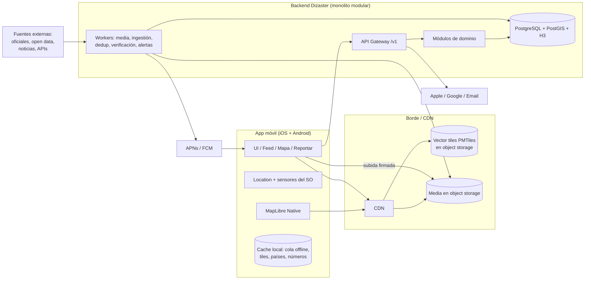
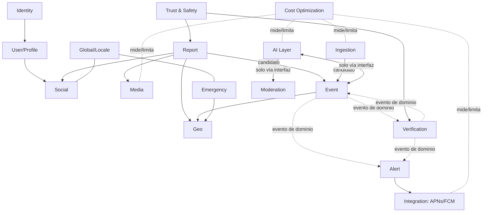
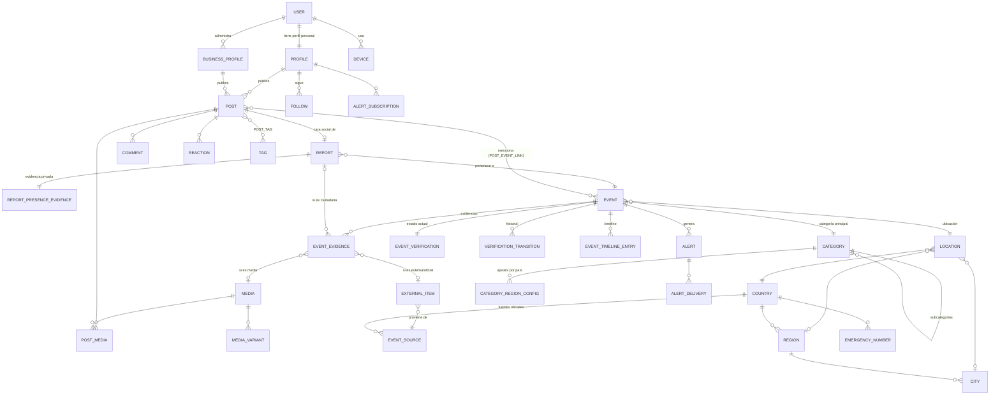
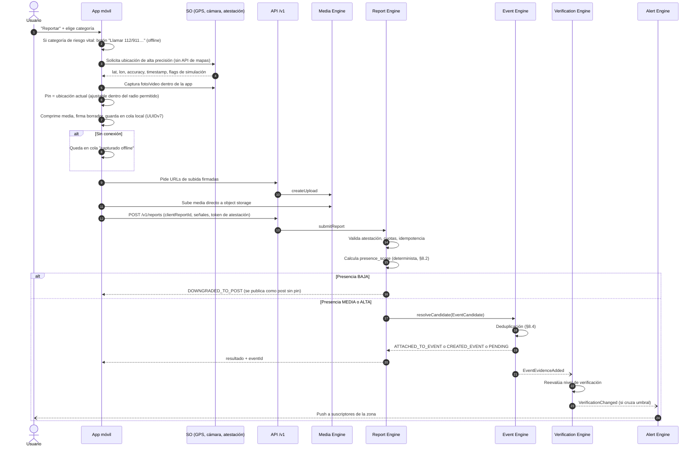
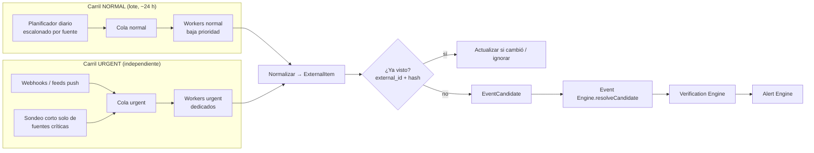
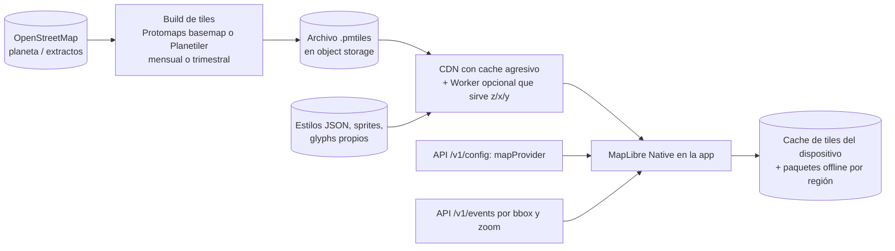

# DIZASTER — Master Blueprint

| Campo | Valor |
|---|---|
| Documento | `docs/DIZASTER_MASTER_BLUEPRINT.md` |
| Versión | 1.0 (aprobada con modificaciones) |
| Fecha | 2026-09-29 |
| Estado | **APROBADO 2026-09-29** con las modificaciones del Anexo A |
| Alcance V1 | Aplicación móvil iOS + Android. Sin web. |
| Regla de aislamiento | Dizaster es 100 % independiente de WEE y MelonOffice. Ningún repositorio, archivo, configuración, credencial ni infraestructura de esos proyectos se abre, reutiliza, importa ni conecta. |

> Este documento es la fundación técnica. Aprobado el 2026-09-29 con las modificaciones del [Anexo A](#anexo-a--aprobación-y-modificaciones-2026-09-29), que prevalecen sobre el texto original donde difieran.

---

## Índice

0. [Resumen ejecutivo](#0-resumen-ejecutivo)
1. [Análisis de requisitos](#1-análisis-de-requisitos)
2. [Contradicciones, tensiones y riesgos detectados](#2-contradicciones-tensiones-y-riesgos-detectados)
3. [Principios de arquitectura](#3-principios-de-arquitectura)
4. [Arquitectura propuesta](#4-arquitectura-propuesta)
5. [Módulos (capas y motores)](#5-módulos-capas-y-motores)
6. [Interfaces entre componentes](#6-interfaces-entre-componentes)
7. [Modelo de datos](#7-modelo-de-datos)
8. [Flujo de un reporte ciudadano](#8-flujo-de-un-reporte-ciudadano)
9. [Flujo de ingestión de fuentes externas (NORMAL y URGENT)](#9-flujo-de-ingestión-de-fuentes-externas)
10. [Sistema de verificación](#10-sistema-de-verificación)
11. [Arquitectura geográfica y de mapas](#11-arquitectura-geográfica-y-de-mapas)
12. [Estrategia de costos (Cost-First)](#12-estrategia-de-costos-cost-first)
13. [Estrategia de seguridad, privacidad y Trust & Safety](#13-estrategia-de-seguridad-privacidad-y-trust--safety)
14. [Estrategia de escalabilidad](#14-estrategia-de-escalabilidad)
15. [Preparación para el futuro (puntos de extensión)](#15-preparación-para-el-futuro-puntos-de-extensión)
16. [Decisiones que requieren tu aprobación](#16-decisiones-que-requieren-tu-aprobación)
17. [Hoja de ruta propuesta](#17-hoja-de-ruta-propuesta)
18. [Estructura inicial del repositorio y documentación](#18-estructura-inicial-del-repositorio-y-documentación)
19. [Glosario](#19-glosario)
20. [Plano de Software Delivery e Ingeniería](#20-plano-de-software-delivery-e-ingeniería)

---

## 0. Resumen ejecutivo

Dizaster es una red social mundial cuyo centro no es la publicación sino el **acontecimiento geolocalizado (EVENT)**. Las publicaciones sociales existen alrededor de los eventos; los reportes ciudadanos los alimentan; las fuentes externas y oficiales los corroboran.

La propuesta se resume en diez decisiones de fondo:

1. **Monolito modular** en el backend para la V1 (un solo despliegue, módulos con fronteras estrictas y contratos explícitos), con un camino documentado para extraer servicios cuando la carga lo justifique. Nada de microservicios, Kafka ni Kubernetes en la V1.
2. **PostgreSQL + PostGIS + H3** como única base de datos de la V1 (datos, geoespacial, colas de trabajo, búsqueda de texto básica). Menos piezas = menos costo y menos fallos.
3. **Tres entidades separadas: POST, REPORT, EVENT.** El POST es contenido social; el REPORT es una afirmación ciudadana con evidencia de presencia física; el EVENT es la representación canónica del acontecimiento real, que nadie "posee" y que el sistema construye a partir de reportes y fuentes.
4. **Presencia física como puntuación determinista** (`presence_score`), calculada en el servidor con señales del dispositivo. Solo un reporte con presencia suficiente puede crear un pin de incidente ciudadano.
5. **Mapa desacoplado y sin proveedor comercial obligatorio:** MapLibre Native (open source) en el móvil + datos OpenStreetMap servidos como vector tiles propios (PMTiles) desde almacenamiento de objetos sin costo de egreso. Obtener la ubicación, colocar el pin y asociarlo al evento no llama a ninguna API de mapas de pago.
6. **Event Engine** con una entidad EVENT común para todas las fuentes, deduplicación determinista por espacio/tiempo/categoría (H3 + ventanas) y la IA solo para los casos ambiguos, con presupuesto.
7. **Verification Engine independiente** con una máquina de estados basada en reglas y evidencia trazable. La IA puede sugerir, nunca confirmar. `OFFICIALLY_CONFIRMED` solo lo produce una fuente oficial registrada.
8. **Ingestión con dos carriles aislados:** NORMAL (lotes cada 24 h) y URGENT (sondeo corto o push para fuentes críticas), con colas, trabajadores y presupuestos separados.
9. **Media Engine preparado para Live** desde el modelo: `Media` con tipo, estado y modo de entrega abstractos; la V1 solo implementa foto y video grabado.
10. **Cost Optimization Layer transversal:** presupuestos por módulo, medidores, cuotas, circuit breakers e interruptores de apagado (kill switches) para todo lo que cueste dinero por uso (IA, SMS, traducción, transcodificación, geocodificación).

---

## 1. Análisis de requisitos

### 1.1 Requisitos funcionales (extraídos y agrupados)

| ID | Requisito | Prioridad V1 |
|---|---|---|
| RF-01 | App móvil nativa iOS + Android; sin web en V1 | Obligatorio |
| RF-02 | Red social: perfiles personales y de negocio, posts, fotos, videos grabados, comentarios, reacciones, compartir, seguir, tags, feed, búsqueda | Obligatorio |
| RF-03 | Incidente ciudadano geolocalizado solo con evidencia razonable de presencia física | Obligatorio (principio fundamental) |
| RF-04 | Ubicación exacta del usuario no pública por defecto | Obligatorio |
| RF-05 | Usar la ubicación actual para colocar el pin, sin API comercial de mapas ni cobro | Obligatorio |
| RF-06 | Mapa base desacoplado y proveedor cartográfico intercambiable | Obligatorio |
| RF-07 | Event Engine: entidad EVENT común desde usuarios, oficiales, open data, noticias, APIs y fuentes futuras | Obligatorio |
| RF-08 | Detección de eventos duplicados y agrupación de reportes | Obligatorio |
| RF-09 | Verification Engine independiente con 4 estados iniciales; separación ciudadano/externo/oficial | Obligatorio |
| RF-10 | Media Engine V1: foto, video grabado, thumbnails, compresión, almacenamiento, reproducción | Obligatorio |
| RF-11 | Arquitectura preparada para Live Video / Live Events sin reconstruir motores | Obligatorio (diseño), no implementación |
| RF-12 | Global: país, idioma, locale, zona horaria, unidades, formatos, categorías regionales, números de emergencia por país, fuentes oficiales por país | Obligatorio |
| RF-13 | Determinar país por contexto geográfico y mostrar números de emergencia | Obligatorio |
| RF-14 | Actualización externa NORMAL (~24 h) y URGENT (independiente) | Obligatorio |
| RF-15 | Alertas | Obligatorio |
| RF-16 | Capas de publicidad y donaciones | Diseño en V1; implementación mínima o diferida (decisión D-14, D-15) |
| RF-17 | Puntos de extensión: live, sensores, drones, clima, salud, integraciones de emergencia, nuevas fuentes, categorías, IA, social, multimedia | Diseño |

### 1.2 Requisitos no funcionales

| ID | Requisito |
|---|---|
| RNF-01 | **Costo operativo mínimo sostenible** (requisito de primer nivel) |
| RNF-02 | Modular, provider-agnostic cuando sea razonable, testeable, observable, seguro |
| RNF-03 | Preparado para millones de usuarios **sin** sobredimensionar la V1 |
| RNF-04 | Privacidad de ubicación por diseño |
| RNF-05 | IA solo cuando una solución determinista no baste; protegida con rate limits, caching, batching, cuotas, presupuestos, circuit breakers y fallback |
| RNF-06 | Aislamiento total de WEE y MelonOffice |

### 1.3 Lectura del producto

La tensión central del producto es que **una red social premia la velocidad y el volumen**, mientras que **una plataforma de incidentes premia la exactitud y la confianza**. Por eso la arquitectura separa:

- la capa social (rápida, abierta, barata) de
- la capa de hechos (EVENT + verificación: más lenta, trazable, conservadora).

Un usuario puede opinar sobre cualquier cosa desde cualquier lugar (POST), pero solo puede **afirmar que algo ocurre en un lugar** si estaba allí (REPORT). Y solo el sistema, a partir de evidencia, decide qué **es** un acontecimiento (EVENT) y cuánta confianza merece (verificación).

---

## 2. Contradicciones, tensiones y riesgos detectados

Cada punto lleva una propuesta. Los que requieren tu decisión están enlazados a la sección 16.

| # | Tensión o contradicción | Por qué importa | Propuesta |
|---|---|---|---|
| C-01 | **"Red social" vs "solo se reporta con presencia física".** ¿Puede alguien publicar sobre un terremoto en otro país? | Si todo lo relacionado con un evento exige presencia, la red social muere; si nada lo exige, el mapa se llena de ruido. | Un POST puede **mencionar o enlazar** cualquier EVENT desde cualquier lugar (comentario, apoyo, noticia). Solo un REPORT con presencia crea o alimenta el pin y la corroboración ciudadana. → D-03 |
| C-02 | **Privacidad vs "usar mi ubicación actual como pin".** Si el pin del incidente es mi posición, publicar el incidente revela dónde estaba yo y cuándo. | En delincuencia, violencia o incidentes domésticos esto puede poner en riesgo al reportante. | (a) El pin es del EVENT, no del usuario; (b) la ubicación pública del evento se **generaliza** según la sensibilidad de la categoría; (c) el autor del reporte puede mostrarse como "Reporte ciudadano verificado en sitio" sin identidad pública; (d) opción de retrasar la publicación en categorías sensibles. → D-05, D-06 |
| C-03 | **"Evidencia razonable de presencia" no es prueba.** El GPS se puede falsificar y ninguna señal móvil es infalible. | Prometer "prueba de presencia" sería falso y peligroso. | Tratar la presencia como **puntuación probabilística** con bandas (alta/media/baja) y comunicarla honestamente en la UI ("presencia verificada por el dispositivo", no "prueba"). |
| C-04 | **Desastres = sin conectividad.** En un terremoto o inundación la red cae justo cuando la gente quiere reportar. | Un diseño "online-only" falla en el caso de uso principal. | Captura offline con evidencia firmada y cola local; el reporte se envía al recuperar conexión y se marca como "capturado offline" con tolerancias de tiempo explícitas. |
| C-05 | **Estados de verificación solo ascendentes.** Los 4 estados propuestos no contemplan "falso" ni "en disputa". | Sin un estado negativo, un bulo corroborado por una banda de cuentas falsas no puede degradarse. | Separar **nivel de verificación** (los 4 estados) de **banderas de disputa/falsedad** y del **estado de ciclo de vida** del evento. → D-07 |
| C-06 | **Global desde el día 1 vs bajo costo.** Moderación, fuentes oficiales y soporte legal por país cuestan. | Lanzar "en todo el mundo" con moderación real en 190 países no es sostenible. | Arquitectura global desde el día 1 (datos, locale, números de emergencia de todos los países), pero **lanzamiento operativo por países piloto** con fuentes oficiales curadas y moderación. → D-02 |
| C-07 | **Delincuencia, robos, vandalismo.** Riesgo de difamación, justicia por mano propia, discriminación y exposición de víctimas. | Riesgo legal y reputacional alto. | Políticas específicas: prohibido identificar personas acusadas, difuminado de rostros/matrículas (decisión), ubicación generalizada, retención reducida. → D-08 |
| C-08 | **Salud y enfermedades.** Alto riesgo de desinformación. | Un "brote" inventado genera pánico. | Los eventos de salud de tipo "brote/enfermedad" solo los crean fuentes oficiales o externas; los ciudadanos pueden reportar **situaciones observables** (hospital saturado, cierre de centro) pero no diagnósticos. → D-09 |
| C-09 | **Publicidad en un contexto de desastres.** | Anuncios junto a víctimas dañan la confianza. | Sin anuncios en pantallas de alerta, emergencia ni en eventos de severidad alta; sin segmentación por ubicación precisa. → D-14 |
| C-10 | **Donaciones.** | Manejar dinero implica regulación, fraude y reglas de las tiendas de apps. | V1: solo enlaces a organizaciones verificadas; Dizaster no toca dinero. → D-15 |
| C-11 | **"Sin web" vs "compartir".** Compartir fuera de la app genera un enlace; sin web ese enlace no abre nada si el destinatario no tiene la app. Los Universal Links (iOS) y App Links (Android) además exigen alojar archivos de verificación en un dominio propio. | "Compartir" no funciona bien sin al menos un dominio. | Un dominio con archivos estáticos: verificación de deep links + una página mínima de vista previa (título, categoría, imagen, "descarga la app"). No es "web de producto". → D-12 |
| C-12 | **"Millones de usuarios" vs "no sobredimensionar".** | Riesgo de construir de más (costo) o de menos (reescritura). | Monolito modular con contratos que permiten extraer servicios; particionado e índices geoespaciales diseñados desde el día 1; infraestructura mínima al inicio. |
| C-13 | **"Detectar el país del usuario" vs privacidad.** | Enviar la ubicación al servidor para saber el país no es necesario. | Detección de país **en el dispositivo** con polígonos simplificados empaquetados en la app; funciona offline y no filtra ubicación. |
| C-14 | **Video grabado para reportes vs importación desde galería.** | Un video de galería puede ser antiguo o de otro lugar. | Reportes: solo captura dentro de la app (o galería con metadatos coherentes y peso de evidencia menor). Posts: galería libre. → D-10 |
| C-15 | **Autenticación barata vs cuentas falsas.** El SMS OTP es la barrera clásica contra bots, pero cuesta dinero por mensaje y varía por país. | Costo directo por usuario. | Inicio con Apple/Google/email (gratis o casi); SMS solo como verificación escalonada para acciones sensibles o cuentas sospechosas, con cuota. → D-11 |
| C-16 | **Edad mínima y menores.** | Contenido de violencia/desastres; obligaciones legales. | Edad mínima 16 (o la más alta requerida por país piloto), filtros de contenido sensible. → D-13 |
| C-17 | **Alertas "según mi ubicación actual".** Requiere ubicación en segundo plano: batería, permisos restrictivos y revisión de tiendas. | Rechazos en App Store / Google Play y pérdida de confianza. | V1: alertas por **zonas guardadas** + última ubicación aproximada cuando la app se abre. Ubicación en segundo plano opcional y posterior. → D-16 |
| C-18 | **Dizaster no es un servicio de emergencias.** | Riesgo legal si alguien reporta en la app en lugar de llamar. | Botón de llamada de emergencia prominente antes de reportar categorías de riesgo vital; aviso legal explícito. |

---

## 3. Principios de arquitectura

1. **Cost-first.** Antes de cualquier servicio externo se evalúa, en este orden: open source → open data → procesamiento local/en dispositivo → cache → batch → bajo demanda → proveedor de menor costo. Todo proveedor se usa detrás de una interfaz propia (adapter) para poder cambiarlo.
2. **Determinista primero, IA después.** Reglas, índices y heurísticas resuelven el caso común; la IA solo entra en la franja ambigua y con presupuesto.
3. **Fronteras de módulo estrictas.** Cada módulo es dueño de sus tablas. Ningún módulo lee ni escribe tablas de otro: se comunica por su interfaz pública o por eventos de dominio.
4. **Evidencia trazable.** Todo cambio de estado de un EVENT (fusión, verificación, estado) queda registrado con su causa, sus evidencias y su actor (usuario, regla, fuente, IA, moderador).
5. **Privacidad por diseño.** La ubicación precisa del usuario es un dato restringido con retención limitada; lo público es la ubicación del evento, generalizada según sensibilidad.
6. **Offline-tolerante.** Las funciones críticas (números de emergencia, detección de país, captura de reporte) funcionan sin red.
7. **Evolución sin reescritura.** Los modelos (Media, Event, Source, Category) se diseñan con tipos abiertos y extensibles; la V1 implementa un subconjunto.
8. **Aislamiento del proyecto.** Cero dependencias de WEE o MelonOffice: repositorio, cuentas cloud, dominios, credenciales, CI y observabilidad propios.

---

## 4. Arquitectura propuesta

### 4.1 Vista de contexto



### 4.2 Estilo: monolito modular con eventos de dominio

- **Un despliegue** (proceso API + procesos worker del mismo código) con módulos aislados.
- **Comunicación síncrona** entre módulos: llamadas a la interfaz pública del módulo (en proceso).
- **Comunicación asíncrona:** *transactional outbox* en PostgreSQL → cola de trabajos en PostgreSQL → handlers. Garantiza que un cambio de datos y su evento de dominio se confirman juntos. La cola está detrás de una interfaz `MessageBus` para reemplazarla (NATS, Redis Streams, Kafka, SQS…) sin tocar los módulos.
- **Colas con prioridad y aislamiento:** `urgent`, `interactive`, `normal`, `batch`. Cada una con trabajadores y límites propios, para que un lote de ingestión nunca retrase una alerta.

**Por qué no microservicios en la V1:** multiplican costo fijo (más instancias, red, observabilidad, despliegues) y complejidad operativa sin beneficio a esta escala. La modularidad estricta conserva la opción de extraerlos después (ver §14).

### 4.3 Stack tecnológico recomendado (sujeto a aprobación, D-01)

| Capa | Recomendación | Alternativa | Motivo |
|---|---|---|---|
| App móvil | **React Native + Expo (TypeScript)** | Flutter (Dart) | Un solo lenguaje (TypeScript) en móvil y backend: tipos y contratos compartidos, un solo perfil de equipo. Ecosistema maduro para cámara, ubicación, notificaciones, MapLibre. Flutter es igual de válido en rendimiento; la diferencia es de equipo y lenguaje. |
| Mapa móvil | **MapLibre Native** (vía `@maplibre/maplibre-react-native`) | — | Open source (BSD), sin licencia por carga de mapa, compatible con cualquier fuente de vector tiles. |
| Backend | **Node.js LTS + TypeScript** (framework ligero tipo Fastify, o NestJS si se prefiere estructura de módulos impuesta) | Go | Tipos compartidos con la app; gran ecosistema. Go es más eficiente en CPU/memoria; se puede usar después para workers intensivos. |
| API | **REST/JSON versionada + OpenAPI** (clientes generados) | GraphQL | Cacheable en CDN, simple, barata. GraphQL añade complejidad y dificulta el cache. |
| Base de datos | **PostgreSQL + PostGIS + extensión H3** | — | Relacional + geoespacial + colas + texto en una sola pieza. |
| Cola / jobs | **Cola sobre PostgreSQL** (p. ej. pg-boss o Graphile Worker) | Redis/BullMQ, NATS | Cero infraestructura adicional en V1. |
| Búsqueda | **PostgreSQL full-text + pg_trgm** | Meilisearch / OpenSearch (fase 2+) | Suficiente para V1; motor dedicado cuando el volumen lo exija. |
| Cache | Cache HTTP en CDN + cache en proceso | Redis (fase 1+) | Redis solo cuando haya varias instancias de API. |
| Object storage | **S3-compatible sin costo de egreso** (p. ej. Cloudflare R2) | Backblaze B2 + CDN aliado, S3 | El egreso de media y tiles es el costo variable más grande; eliminarlo es la mayor palanca de ahorro. |
| CDN | Cloudflare (plan gratuito/pro) | Bunny CDN | Cache de tiles, media y respuestas públicas. |
| Cómputo | ~~VPS/servidores de bajo costo con contenedores~~ → **Google Cloud: Cloud Run + Cloud SQL/PostGIS** (instrucción del propietario 2026-09-30, ADR 0261; activar proyectos y facturación sigue pendiente) | VPS con los mismos contenedores | Contenedores Docker portables: se puede cambiar de proveedor sin reescribir. |
| Push | **APNs + FCM** directos | OneSignal y similares | Gratis. |
| Email | Proveedor transaccional económico (p. ej. Amazon SES) | Postmark, Resend | Solo para login por email y avisos. |
| Observabilidad | **OpenTelemetry** + Grafana/Prometheus/Loki autoalojados o capa gratuita de Grafana Cloud; Sentry (capa gratuita o autoalojado) para crashes | — | Estándar abierto, cambiable. |
| CI/CD | GitHub Actions (repositorio nuevo y propio de Dizaster) + EAS Build (Expo) o Fastlane, orquestados por el **Dizaster Delivery Control Plane** propio (§20) | — | Sin plataformas comerciales de delivery. |

---

## 5. Módulos (capas y motores)

Cada módulo se describe con: **responsabilidad**, **datos que posee**, **V1** (qué se construye) y **extensión** (qué queda preparado).

### 5.1 Identity Layer
- **Responsabilidad:** autenticación, sesiones, dispositivos, verificación escalonada (step-up), vinculación de proveedores (Apple, Google, email).
- **Datos:** `User`, `AuthIdentity`, `Session`, `Device`, `DeviceAttestation`.
- **V1:** Sign in with Apple (obligatorio en iOS si hay otros logins sociales), Google, email con código/enlace mágico; tokens de acceso de vida corta + refresh rotatorio; registro de dispositivo con atestación (App Attest / Play Integrity); eliminación de cuenta dentro de la app (exigida por las tiendas).
- **Extensión:** SMS/WhatsApp OTP como step-up, passkeys, cuentas de organización con varios administradores, SSO para instituciones oficiales.
- **Proveedor:** detrás de `IdentityProvider`. Recomendación: implementación propia con librerías estándar OIDC/JWT (sin costo por usuario activo). Alternativas: Ory Kratos, Zitadel, Keycloak (autoalojados). Se evitan servicios que cobren por MAU.

### 5.2 User/Profile Engine
- **Responsabilidad:** perfiles personales y de negocio, preferencias, privacidad, zonas guardadas, reputación visible.
- **Datos:** `Profile`, `BusinessProfile`, `ProfileSettings`, `SavedPlace`, `BusinessVerification`.
- **V1:** perfil personal, perfil de negocio (sin verificación de pago), idioma/unidades/país preferidos, zonas guardadas para alertas.
- **Extensión:** perfiles institucionales oficiales (agencias de protección civil, bomberos) con insignia; perfiles de ONG para donaciones.

### 5.3 Social Engine
- **Responsabilidad:** posts, comentarios, reacciones, compartir, seguir, tags, feed, menciones.
- **Datos:** `Post`, `Comment`, `Reaction`, `Share`, `Follow`, `Tag`, `PostTag`, `FeedItem` (si se materializa).
- **V1:** feed de seguidos (fan-out on read) + feed "cerca de mí" (por celdas H3 de eventos) + feed de un evento; ranking determinista (recencia, cercanía, severidad, verificación). Sin ML de recomendación.
- **Extensión:** feed materializado (fan-out on write) para cuentas con muchos seguidores, grupos/comunidades, mensajes directos, ranking personalizado.

### 5.4 Report Engine
- **Responsabilidad:** recibir el reporte ciudadano, validar presencia, crear la parte social (Post) y entregar el candidato al Event Engine.
- **Datos:** `Report`, `ReportPresenceEvidence` (restringida), `ReportDraft` (en el dispositivo).
- **V1:** flujo completo de §8, captura offline, cálculo de `presence_score`, degradación a Post cuando no hay presencia.
- **Extensión:** reportes desde sensores, reportes de organizaciones, reportes con voz.

### 5.5 Geo Engine
- **Responsabilidad:** todo cálculo geográfico que **no** es dibujo de mapa: distancias, H3, generalización (coarsening), geocercas, país/región/ciudad por punto, zona horaria por punto, validación de coordenadas.
- **Datos:** `Country`, `Region`, `City`, `AdminBoundary`, `TimezoneBoundary`, índices H3.
- **V1:** PostGIS + H3; límites administrativos de datos abiertos (Natural Earth, geoBoundaries, OSM); zonas horarias de *timezone-boundary-builder* (open data); geocodificación inversa **propia** a nivel país/región/ciudad (sin API externa).
- **Extensión:** geocodificación directa (búsqueda de direcciones) con Photon/Nominatim autoalojados; geometrías complejas (perímetros de incendio, zonas inundadas), trayectorias (geo tracks) para live y drones.

### 5.6 Map Engine
- **Responsabilidad:** mostrar el mapa base y las capas de Dizaster; abstraer el proveedor cartográfico.
- **Datos:** `MapProviderConfig` (remota), estilos, sprites, glyphs, paquetes offline.
- **V1:** MapLibre + vector tiles OSM propios (PMTiles) + capa de eventos como GeoJSON/clusters servida por la API; configuración remota del estilo y la fuente de tiles.
- **Extensión:** imágenes satelitales, capas meteorológicas, capas de sensores, mapas 3D. Ver §11.
- **Separación clave:** el Map Engine **dibuja**; el Geo Engine **calcula**; el Event Engine **no sabe** qué proveedor de mapa se usa.

### 5.7 Event Engine
- **Responsabilidad:** crear, resolver, fusionar, dividir y mantener EVENTs a partir de *EventCandidates* de cualquier origen; timeline; ubicación y severidad agregadas; ciclo de vida.
- **Datos:** `Event`, `EventEvidence`, `EventSource` (vínculo a fuente externa), `EventTimelineEntry`, `EventMergeLog`, `EventCategoryAssignment`.
- **V1:** resolución de candidatos, deduplicación determinista (§8.4), timeline, ciclo de vida (ACTIVE → MONITORING → RESOLVED → ARCHIVED), fusión/división manual por moderadores y automática con umbrales.
- **Extensión:** eventos compuestos (un terremoto con réplicas y eventos hijos), eventos móviles (huracán con trayectoria), eventos "live".

### 5.8 Verification Engine
- **Responsabilidad:** calcular y mantener el nivel de confianza de cada EVENT de forma independiente al Event Engine. Ver §10.
- **Datos:** `EventVerification` (estado actual), `VerificationTransition` (historial), `VerificationRuleSet` (versionado), `SourceTrust`.
- **V1:** motor de reglas versionado; niveles y banderas; explicación legible del estado.
- **Extensión:** reglas por país/categoría, verificadores humanos acreditados, firmas criptográficas de fuentes oficiales.

### 5.9 Media Engine
- **Responsabilidad:** subida, validación, procesamiento, almacenamiento, entrega y ciclo de vida de media.
- **Datos:** `Media`, `MediaVariant`, `MediaProcessingJob`, `MediaHash`.
- **V1:** foto y video grabado; compresión en el dispositivo; subida directa a object storage con URL firmada; worker que valida, genera thumbnails y variantes, calcula hash criptográfico y perceptual, elimina metadatos EXIF sensibles de la versión pública; entrega por CDN; reproducción MP4 progresiva (límite de duración, p. ej. 60 s).
- **Extensión (Live):** `Media.kind = LIVE_STREAM`, `delivery = WEBRTC | LL_HLS`, estado `LIVE → ENDED → VOD_READY`, grabación del directo como media normal. Ver §15.

### 5.10 Alert Engine
- **Responsabilidad:** decidir a quién notificar sobre qué y cuándo; entregar notificaciones; evitar fatiga.
- **Datos:** `AlertRule`, `AlertSubscription`, `Alert`, `AlertDelivery`.
- **V1:** suscripción por zonas guardadas (conjuntos de celdas H3) + categorías + severidad mínima; disparo por evento que cruza un umbral de verificación/severidad o por alerta oficial (URGENT); push por APNs/FCM; límites por usuario (máx. N por hora), horas de silencio (salvo alertas oficiales críticas).
- **Extensión:** Cell Broadcast / integraciones con sistemas públicos de alerta, SMS para usuarios sin datos, alertas por ubicación en segundo plano.

### 5.11 Emergency Engine
- **Responsabilidad:** números de emergencia y guía de actuación por país/región; siempre disponible offline.
- **Datos:** `EmergencyNumber`, `EmergencyGuide` (futuro), dataset versionado.
- **V1:** dataset curado de números por país (y subnacional cuando aplica: policía, bomberos, ambulancia, número unificado); empaquetado en la app + actualización diferencial; detección de país en el dispositivo; botón "Llamar" en pantallas de reporte de riesgo vital.
- **Extensión:** integración con centros de emergencia (NG112, APIs de despacho), guías de primeros auxilios offline, SOS con envío de ubicación a contactos.

### 5.12 AI Layer
- **Responsabilidad:** única puerta de acceso a modelos de IA (propios o de terceros) con control de costo.
- **Datos:** `AiTask`, `AiResultCache`, `AiBudget`, `AiUsageMeter`.
- **V1 (casos permitidos):**
  - Deduplicación **solo en la franja ambigua** (§8.4).
  - Moderación de texto y de imágenes **como segunda línea** tras filtros deterministas (hashes de contenido prohibido, listas, heurísticas).
  - Resumen de un EVENT **solo** cuando tiene ≥ N reportes o fuentes, en lote y con cache hasta que cambie materialmente.
  - Traducción **bajo demanda** (el usuario pulsa "traducir"), con cache por (contenido, idioma).
- **Prohibido:** que la IA establezca cualquier nivel de verificación, que genere hechos no presentes en las fuentes, clasificar cada post con IA cuando la categoría la eligió el usuario.
- **Controles:** presupuesto diario/mensual por tarea, rate limit, batching, cache, circuit breaker con fallback determinista, registro de proveedor/modelo/versión por resultado.
- **Extensión:** modelos locales/autoalojados, clasificación de imágenes en dispositivo, análisis de video.

### 5.13 External Source / Ingestion Layer
- **Responsabilidad:** registro de fuentes, adaptadores, recolección (pull/push), normalización a un formato común, carriles NORMAL y URGENT. Ver §9.
- **Datos:** `SourceRegistry` (= `EventSource` como definición de fuente, ver §7), `SourceAdapterConfig`, `ExternalItem` (dato bruto + normalizado), `IngestionRun`.

### 5.14 Integration Layer
- **Responsabilidad:** comunicaciones salientes y entrantes con sistemas de terceros que **no** son fuentes de eventos: push, email, SMS, tiendas de apps, pagos futuros, webhooks para socios, API pública futura.
- **Regla:** todo proveedor externo vive detrás de un adapter con interfaz propia, métricas de costo y circuit breaker.

### 5.15 Global/Locale Layer
- **Responsabilidad:** idiomas, traducciones de interfaz, formatos regionales, unidades, zonas horarias, categorías regionales, configuración por país.
- **Datos:** `Locale`, `Translation` (catálogos), `CountryConfig`, `CategoryRegionConfig`.
- **V1:** interfaz en varios idiomas (catálogos ICU MessageFormat; arranque sugerido: español, inglés, portugués, francés); fechas guardadas en UTC y mostradas en la zona del evento y del usuario; unidades métricas/imperiales por preferencia/país; detección de idioma del contenido con un modelo ligero local (sin costo por llamada).
- **Extensión:** idiomas RTL (árabe, hebreo) previstos en el diseño de UI desde el inicio.

### 5.16 Advertising Layer
- **Responsabilidad:** espacios publicitarios, promociones de perfiles de negocio, reglas de exclusión.
- **V1:** solo el diseño y las reglas (dónde **no** puede haber anuncios). Implementación diferida (D-14).
- **Reglas fijas:** nunca en alertas, emergencia, reportes ni eventos de severidad alta; nunca segmentación por ubicación precisa; anuncios claramente marcados.

### 5.17 Donation Layer
- **Responsabilidad:** conectar eventos con organizaciones verificadas que reciben ayuda.
- **V1:** diseño + opcionalmente enlaces externos a organizaciones verificadas (sin manejo de dinero). D-15.
- **Extensión:** donaciones integradas vía proveedor de pagos, sujeto a las reglas de cada tienda y a la regulación del país.

### 5.18 Cost Optimization Layer
- **Responsabilidad transversal:** medir y limitar el costo de todo lo que cuesta por uso. Ver §12.
- **Componentes:** `CostMeter` (contador por operación y proveedor), `Budget` (diario/mensual por módulo), `Quota` (por usuario/dispositivo/país), `CircuitBreaker`, `KillSwitch` (feature flags remotos), tablero de costo.

### 5.19 Security Layer
- **Responsabilidad transversal:** autenticación/autorización, cifrado, gestión de secretos, protección de API, integridad del dispositivo, auditoría. Ver §13.

### 5.20 Trust & Safety Layer
- **Responsabilidad:** reputación de usuarios y dispositivos, detección de abuso (granjas de cuentas, coordinación, spoofing), políticas de contenido sensible, respuesta a solicitudes legales.
- **Datos:** `TrustScore`, `AbuseSignal`, `DeviceReputation`, `LegalRequest`.

### 5.21 Moderation Layer
- **Responsabilidad:** colas de revisión, acciones (ocultar, eliminar, advertir, suspender), apelaciones, transparencia.
- **Datos:** `ModerationCase`, `ModerationAction`, `Appeal`, `UserFlag`.
- **V1:** reportes de usuarios, cola priorizada por severidad y alcance, herramientas para fusionar/dividir eventos, registro auditable.
- **Nota:** la herramienta de moderación es interna. Como no hay web de producto en V1, se propone un **panel interno mínimo** (no público) o herramientas de administración dentro de la app para roles de moderador. → D-12

### 5.22 Observability Layer
- **Responsabilidad:** logs estructurados, métricas, trazas, crashes móviles, alertas operativas, métricas de costo y de calidad del producto (tasa de duplicados, tiempos de verificación).
- **Estándar:** OpenTelemetry en backend; SDK de crashes en móvil; tableros por módulo; SLO iniciales (p. ej. p95 de la API < 300 ms, alerta oficial URGENT entregada < 2 min desde su publicación en la fuente).

### 5.23 Mapa de dependencias entre módulos



Regla: las flechas punteadas son **eventos de dominio asíncronos**; las continuas son llamadas a interfaces públicas. El Verification Engine y el Event Engine **no se llaman directamente en ciclo**: se comunican por eventos para mantener la independencia exigida.

---

## 6. Interfaces entre componentes

Los contratos se expresan en pseudocódigo TypeScript para ser precisos; son **intención de diseño**, no código final.

### 6.1 Contratos síncronos principales

```ts
// ---------- Report Engine ----------
interface ReportService {
  submitReport(cmd: SubmitReportCommand): Promise<SubmitReportResult>;
  getReport(reportId: Id, viewer: Viewer): Promise<ReportView>;      // aplica reglas de privacidad
  withdrawReport(reportId: Id, actor: Actor): Promise<void>;
}

type SubmitReportCommand = {
  clientReportId: Uuid;               // idempotencia (reintentos offline)
  authorProfileId: Id;
  categoryCode: CategoryCode;          // p. ej. "fire.structure"
  text?: string;
  mediaIds: Id[];                      // media ya subida y en estado READY/PROCESSING
  pin: GeoPoint;                       // punto elegido para el incidente
  presence: PresenceSignals;           // señales crudas del dispositivo (§8.2)
  capturedAt: Instant;                 // hora de captura en el dispositivo
  capturedOffline: boolean;
  anonymityMode: "PUBLIC" | "PSEUDONYMOUS";
};

type SubmitReportResult =
  | { outcome: "ATTACHED_TO_EVENT"; reportId: Id; eventId: Id; presenceBand: Band }
  | { outcome: "CREATED_EVENT";     reportId: Id; eventId: Id; presenceBand: Band }
  | { outcome: "PENDING_RESOLUTION"; reportId: Id }                // resolución asíncrona
  | { outcome: "DOWNGRADED_TO_POST"; postId: Id; reason: PresenceRejectionReason };

// ---------- Geo Engine ----------
interface GeoService {
  h3(point: GeoPoint, res: number): H3Index;
  kRing(cell: H3Index, k: number): H3Index[];
  distanceMeters(a: GeoPoint, b: GeoPoint): number;
  resolveAdmin(point: GeoPoint): AdminContext;           // país, región, ciudad, tz
  generalize(point: GeoPoint, sensitivity: Sensitivity): PublicGeometry;
}

// ---------- Event Engine ----------
interface EventService {
  resolveCandidate(c: EventCandidate): Promise<ResolutionResult>;   // crear, adjuntar o dudar
  getEvent(eventId: Id, viewer: Viewer): Promise<EventView>;
  queryEvents(q: EventQuery): Promise<Page<EventSummary>>;          // bbox / H3 / categoría / tiempo
  merge(target: Id, sources: Id[], actor: Actor, reason: string): Promise<void>;
  split(eventId: Id, evidenceIds: Id[], actor: Actor): Promise<Id>;
  setLifecycle(eventId: Id, status: EventStatus, actor: Actor): Promise<void>;
}

// El candidato común: TODA fuente se reduce a esto
type EventCandidate = {
  origin: "CITIZEN_REPORT" | "OFFICIAL" | "EXTERNAL" | "OPEN_DATA" | "NEWS" | "SENSOR" | string;
  originRef: { kind: "REPORT" | "EXTERNAL_ITEM" | string; id: Id };
  categoryCode: CategoryCode;
  geometry: Geometry;                    // punto, polígono o línea
  locationUncertaintyM: number;          // radio de incertidumbre
  occurredAt: Instant | TimeRange;
  observedAt: Instant;
  severityHint?: Severity;
  title?: LocalizedText; summary?: LocalizedText;
  mediaIds?: Id[];
  externalIds?: string[];                // ids de la fuente para deduplicar exacto
  trustTier: TrustTier;                  // derivado del origen y la fuente
  metadata: Record<string, unknown>;     // extensible, validado por esquema por origen
};

// ---------- Verification Engine ----------
interface VerificationService {
  evaluate(eventId: Id, trigger: VerificationTrigger): Promise<VerificationState>;
  getState(eventId: Id): Promise<VerificationState & { explanation: Explanation[] }>;
  applyModeratorOverride(eventId: Id, change: OverrideCommand, actor: Moderator): Promise<void>;
}

// ---------- Media Engine ----------
interface MediaService {
  createUpload(req: UploadRequest): Promise<{ mediaId: Id; uploadUrl: SignedUrl; expiresAt: Instant }>;
  completeUpload(mediaId: Id, checksum: Sha256): Promise<void>;     // encola el procesamiento
  getPlayback(mediaId: Id, viewer: Viewer): Promise<PlaybackDescriptor>; // URL de CDN o manifiesto
}

// ---------- Alert Engine ----------
interface AlertService {
  subscribe(profileId: Id, sub: AlertSubscriptionInput): Promise<Id>;
  evaluateForEvent(eventId: Id, reason: AlertReason): Promise<void>;   // llamado por handler
}

// ---------- Emergency Engine ----------
interface EmergencyService {
  numbersFor(countryCode: Iso3166Alpha2, subdivision?: string): EmergencyNumber[];
  datasetVersion(): string;              // la app compara y descarga diff
}

// ---------- Ingestion ----------
interface SourceAdapter {                 // un adapter por tipo de fuente
  readonly sourceType: string;            // "usgs-geojson", "cap-atom", "gdacs-rss", ...
  fetch(ctx: FetchContext): AsyncIterable<RawItem>;     // respeta ETag/If-Modified-Since
  normalize(raw: RawItem): NormalizedItem | Rejected;
  toCandidates(item: NormalizedItem): EventCandidate[];
}

// ---------- AI Layer ----------
interface AiGateway {
  run<T>(task: AiTaskType, input: AiInput, opts: { budgetKey: string; cacheKey?: string;
         timeoutMs: number; fallback: () => T }): Promise<AiResult<T>>;
}

// ---------- Cost Optimization ----------
interface CostGuard {
  check(budgetKey: string, units: number): Allow | Deny;   // antes de gastar
  record(budgetKey: string, units: number, provider: string, meta?: object): void;
  isKilled(feature: string): boolean;                       // kill switch remoto
}

// ---------- Map Engine (en la app) ----------
interface MapProvider {
  styleUrl(theme: "light" | "dark", locale: string): string;
  attribution(): string;
  offlineRegionSupport: boolean;
}
```

### 6.2 Eventos de dominio (asíncronos, vía outbox)

| Evento | Productor | Consumidores | Notas |
|---|---|---|---|
| `ReportSubmitted` | Report | Event, Trust&Safety, Observability | Incluye `presence_band`, no la ubicación precisa |
| `ReportDowngradedToPost` | Report | Social, Trust&Safety | |
| `MediaUploaded` / `MediaReady` / `MediaRejected` | Media | Report, Social, Moderation | |
| `ExternalItemIngested` | Ingestion | Event | Con `lane = NORMAL \| URGENT` |
| `EventCreated` | Event | Verification, Alert, Social (feed), Search | |
| `EventEvidenceAdded` | Event | Verification | Nueva evidencia = reevaluar |
| `EventMerged` / `EventSplit` | Event | Verification, Alert, Social, Search | Redirecciones de ids |
| `EventLifecycleChanged` | Event | Alert, Social | |
| `VerificationChanged` | Verification | Event (timeline), Alert, Social | Incluye explicación |
| `AlertTriggered` | Alert | Integration (push) | |
| `ModerationActionTaken` | Moderation | Social, Event, Report, Trust&Safety | |
| `BudgetThresholdReached` | Cost | Observability, módulo afectado | Activa degradación |

Todos los eventos llevan: `eventId`, `type`, `version` del esquema, `occurredAt`, `correlationId`, `actor`. Los consumidores son **idempotentes**.

### 6.3 API móvil (visión general)

- `/v1/auth/*`, `/v1/me`, `/v1/profiles/*`
- `/v1/posts`, `/v1/posts/{id}/comments`, `/v1/posts/{id}/reactions`, `/v1/feed?type=following|nearby|event`
- `/v1/reports` (POST idempotente por `clientReportId`)
- `/v1/events?bbox=…&zoom=…&categories=…&since=…` → clusters/puntos para el mapa (cacheable por celda)
- `/v1/events/{id}`, `/v1/events/{id}/timeline`, `/v1/events/{id}/posts`
- `/v1/media/uploads` (URL firmada), `/v1/media/{id}/complete`
- `/v1/alerts/subscriptions`, `/v1/places`
- `/v1/reference/emergency-numbers?since=version`, `/v1/reference/categories?locale=…`, `/v1/config` (config remota: proveedor de mapa, kill switches, límites)
- Paginación por cursor; ETag en recursos cacheables; versionado de API por prefijo.

---

## 7. Modelo de datos

### 7.1 La distinción fundamental: POST vs REPORT vs EVENT

| | **POST** | **REPORT** | **EVENT** |
|---|---|---|---|
| **Qué es** | Contenido social: opinión, foto, video, noticia, comentario sobre algo | Una **afirmación ciudadana** de que algo está ocurriendo **aquí y ahora**, con evidencia de presencia física | La **representación canónica** de un acontecimiento del mundo real |
| **Quién lo crea** | Un perfil (persona o negocio) | Un perfil **que estaba en el lugar** | **El sistema** (Event Engine), a partir de reportes y fuentes. Nadie lo "posee" |
| **Requiere presencia** | No | **Sí** (presence_score ≥ umbral) | No aplica |
| **Ubicación** | Opcional; si la tiene, es informativa | Obligatoria: pin + señales de presencia (privadas) | Geometría agregada del acontecimiento; pública, generalizada según sensibilidad |
| **Cardinalidad** | Puede enlazar 0..N eventos (menciones) | Pertenece a **exactamente 1** EVENT (tras la resolución) | Agrupa 1..N reportes, 0..N fuentes externas, 0..N posts enlazados |
| **Aparece en el mapa** | No como pin propio | No como pin propio: alimenta el pin del EVENT | **Sí**: es el pin |
| **Cuenta para verificación** | No | Sí (evidencia ciudadana) | Es el sujeto verificado |
| **Ciclo de vida** | publicado / editado / eliminado | enviado / aceptado / rechazado / retirado | ACTIVE / MONITORING / RESOLVED / ARCHIVED |
| **Ejemplo** | "Fuerza a todos en Valparaíso" enlazado al evento del incendio | "Veo fuego en el cerro, estoy a 200 m" + foto capturada en la app | "Incendio forestal, Viña del Mar, desde 14:05, 12 reportes, 2 fuentes, EXTERNALLY_CORROBORATED" |

**Relación física propuesta:** todo REPORT tiene una "cara social" que es un POST (`post.kind = REPORT`), para que comentarios, reacciones y compartir funcionen igual en todo el contenido. La parte de hechos y evidencia vive en la tabla `report`, con su propio control de acceso. Así:

- el Social Engine trata todos los posts igual;
- el Report Engine y el Verification Engine trabajan solo con `report`, sin depender del contenido social;
- si un reporte se retira, el EVENT recalcula su evidencia sin tocar el feed.

### 7.2 Diagrama entidad-relación (núcleo)



### 7.3 Entidades

Convenciones: ids **UUIDv7** (ordenables por tiempo, generables offline en el cliente), marcas de tiempo en UTC, `created_at/updated_at`, borrado lógico donde haya obligación de auditoría, textos localizables como `jsonb` `{locale: texto}` o tabla de traducciones.

#### Identidad y perfiles

| Entidad | Campos clave | Notas |
|---|---|---|
| **User** | id, status (ACTIVE, SUSPENDED, DELETED), birth_year_verified?, primary_locale, trust_score_ref, created_at | Cuenta privada. Nunca se expone directamente. |
| **AuthIdentity** | user_id, provider (APPLE, GOOGLE, EMAIL, PHONE), subject, verified_at | Varias por usuario. |
| **Device** | id, user_id, platform, app_version, push_token, attestation_status, last_seen_at, reputation | Clave para anti-abuso: un dispositivo no puede corroborar dos veces el mismo evento. |
| **Profile** | id, user_id, handle, display_name, avatar_media_id, bio, home_country, locale, units, privacy_settings, visibility | Perfil personal (1:1 con User). |
| **BusinessProfile** | id, owner_user_id, handle, name, category, country, address_public?, contact, verification_status | Varios administradores en el futuro (`BusinessMember`). Puede publicar posts; **no** puede crear reportes ciudadanos salvo que un humano presente reporte en su nombre (decisión D-04). |
| **SavedPlace** | profile_id, label, h3_cells[], radius_m, alert_prefs | Zonas de alerta. |

#### Social

| Entidad | Campos clave | Notas |
|---|---|---|
| **Post** | id, author_type (PROFILE, BUSINESS), author_id, kind (STANDARD, REPORT, SHARE, OFFICIAL_UPDATE), text, lang, visibility, location_public? (generalizada), created_at, moderation_state | `kind = REPORT` enlaza 1:1 con Report. |
| **PostEventLink** | post_id, event_id, link_type (REPORT, MENTION, UPDATE) | Un post puede comentar eventos sin presencia. |
| **Comment** | id, post_id, author, parent_comment_id?, text, moderation_state | Hilos de 1 nivel en V1. |
| **Reaction** | subject_type (POST, COMMENT), subject_id, profile_id, type | Tipos de reacción apropiados al contexto (p. ej. apoyo, útil, visto también). |
| **Share** | id, post_id, profile_id, target (INTERNAL, EXTERNAL) | Compartir interno es un Post `kind = SHARE`. |
| **Follow** | follower_profile_id, target_type (PROFILE, BUSINESS, EVENT, TAG, PLACE), target_id | Seguir un evento = recibir su timeline. |
| **Tag** | id, normalized, display | Hashtags libres. |
| **PostTag** | post_id, tag_id | |

#### Reportes y presencia

| Entidad | Campos clave | Notas |
|---|---|---|
| **Report** | id, post_id, author_profile_id, event_id (nullable hasta resolución), category_code, pin (geography), pin_h3_r9, captured_at, received_at, captured_offline, presence_score, presence_band (HIGH, MEDIUM, LOW), status (PENDING, ACCEPTED, REJECTED, WITHDRAWN), anonymity_mode, client_report_id (único) | Visible con reglas de privacidad. |
| **ReportPresenceEvidence** | report_id, device_fix (lat, lon, accuracy_m, altitude, speed, heading, fix_time, provider), fix_to_pin_distance_m, mock_location_flag, attestation_verdict, media_capture_proofs, network_hints (opcional), score_breakdown (jsonb), rule_version, **expires_at** | **Restringida**: solo Report Engine, Verification, Trust&Safety y moderación con motivo registrado. Se generaliza o elimina tras el periodo de retención (D-06). |

#### Eventos

| Entidad | Campos clave | Notas |
|---|---|---|
| **Event** | id, category_code, secondary_categories[], title (localizable), summary, geometry (point/polygon/line), public_geometry (generalizada), uncertainty_m, h3_r7, h3_r9, country_code, region_id, city_id, timezone, occurred_start, occurred_end?, first_seen_at, last_activity_at, severity (1–5), status (ACTIVE, MONITORING, RESOLVED, ARCHIVED), verification_level (denormalizado), flags (DISPUTED, FALSE, SENSITIVE), report_count, source_count, merged_into_id?, parent_event_id? | Particionable por tiempo. `parent_event_id` permite eventos compuestos. |
| **EventEvidence** | id, event_id, evidence_type (CITIZEN_REPORT, EXTERNAL_ITEM, OFFICIAL_ITEM, MEDIA, MODERATOR_NOTE, SENSOR…), ref_id, trust_tier (CITIZEN, EXTERNAL, OFFICIAL), weight, added_at, added_by (RULE, AI_SUGGESTION_ACCEPTED, MODERATOR), match_score, status (ACTIVE, DETACHED) | Tabla pivote única de evidencias: **siempre** conserva de qué tipo es cada una, para no mezclar ciudadano/externo/oficial. |
| **EventSource** | id, name, type (OFFICIAL, EXTERNAL, OPEN_DATA, NEWS, API, SENSOR…), country_scope[], categories[], trust_tier, license, terms_url, adapter_type, config, schedule_normal, urgent_capable, urgent_config, status, owner_contact | Es el **registro de fuentes** (definición de la fuente, no el dato). |
| **ExternalItem** | id, source_id, external_id, content_hash, fetched_at, published_at, raw_ref (object storage), normalized (jsonb), lane (NORMAL, URGENT), status (NEW, MAPPED, IGNORED, ERROR) | Único por (source_id, external_id). Se guarda el crudo para auditoría y re-procesamiento. |
| **EventVerification** | event_id, level (UNVERIFIED, COMMUNITY_CORROBORATED, EXTERNALLY_CORROBORATED, OFFICIALLY_CONFIRMED), flags, rule_set_version, evaluated_at, explanation (jsonb) | Estado actual. |
| **VerificationTransition** | id, event_id, from_level, to_level, flags_delta, cause (RULE, OFFICIAL_SOURCE, MODERATOR), evidence_ids[], rule_id, actor, at | Historial inmutable. |
| **EventTimelineEntry** | id, event_id, type (CREATED, REPORT_ADDED, SOURCE_ADDED, OFFICIAL_UPDATE, VERIFICATION_CHANGED, STATUS_CHANGED, MEDIA_ADDED, MERGED, SPLIT, LIVE_STARTED…), payload, visibility, at | Tipo abierto: nuevas entradas sin migrar. |
| **EventMergeLog** | id, target_event_id, merged_event_id, reason, score, actor, at, reverted_at? | Fusiones reversibles. |

#### Geografía y localización

| Entidad | Campos clave | Notas |
|---|---|---|
| **Location** (tipo valor) | geometry, uncertainty_m, h3 indexes, country_code, region_id, city_id, timezone, address_text? | Se incrusta en Event/Report en vez de tabla separada para evitar joins en la ruta caliente; la tabla `location` existe para lugares nombrados reutilizables si se necesitan. |
| **Country** | iso2, iso3, names (localizables), default_locale, languages[], units, calling_code, timezone_default, geometry_simplified, launch_status (PILOT, AVAILABLE, RESTRICTED), config | |
| **Region** | id, country_iso2, code (ISO 3166-2), names, geometry | |
| **City** | id, region_id, country_iso2, names, population?, geometry o centroide | Fuente: GeoNames/OSM/geoBoundaries (licencias abiertas; ver §11). |
| **EmergencyNumber** | id, country_iso2, subdivision_code?, service (GENERAL, POLICE, FIRE, AMBULANCE, COAST_GUARD, MOUNTAIN, POISON, WOMEN, CHILD…), number, notes (localizables), source, verified_at, dataset_version | Curado y versionado. |
| **Category** | code (jerárquico: `natural.earthquake`, `fire.wildfire`, `crime.robbery`, `health.outbreak`, `infra.power_outage`, `help.community`…), parent_code, names, icon, default_severity, **presence_radius_m**, **dedup_radius_m**, **dedup_window**, sensitivity (NORMAL, SENSITIVE, HIGHLY_SENSITIVE), citizen_reportable, official_only, alertable, status | Configuración que gobierna presencia, deduplicación y privacidad. Nuevas categorías = datos, no código. |
| **CategoryRegionConfig** | category_code, country_iso2, overrides (nombres locales, visibilidad, radios, reportable), enabled | Categorías regionales (p. ej. "huaico" en Perú, "tornado" en EE. UU.). |

#### Media

| Entidad | Campos clave | Notas |
|---|---|---|
| **Media** | id, owner_profile_id, kind (IMAGE, VIDEO_RECORDED, LIVE_STREAM, AUDIO, DOCUMENT, SENSOR_FEED…), state (PENDING_UPLOAD, UPLOADED, PROCESSING, READY, REJECTED, LIVE, ENDED, DELETED), delivery (FILE, HLS, LL_HLS, WEBRTC…), captured_in_app, captured_at, duration_ms, width, height, sha256, phash, storage_key_original (privado), moderation_state, capture_geo (privado) | Modelo **ya preparado para live**: la V1 solo usa IMAGE/VIDEO_RECORDED y FILE. |
| **MediaVariant** | media_id, variant (THUMB_S, THUMB_M, DISPLAY, VIDEO_720, POSTER…), storage_key, bytes, mime | Versiones públicas sin EXIF sensible. |
| **GeoTrack** (futuro, definida desde ya) | id, subject_type (MEDIA, EVENT, DEVICE), points (tiempo, posición) | Para streams móviles, drones, trayectorias de tormentas. |

#### Alertas, confianza y moderación

| Entidad | Campos clave | Notas |
|---|---|---|
| **Alert** | id, event_id, origin (OFFICIAL, SYSTEM), severity, area (h3 cells / polygon), title/body localizables, issued_at, expires_at, cap_ref? | Compatible con el estándar **CAP** (Common Alerting Protocol). |
| **AlertSubscription** | profile_id, area (h3 cells), categories[], min_severity, quiet_hours, channels | |
| **AlertDelivery** | alert_id, profile_id, device_id, status, sent_at | Para límites de frecuencia y métricas. |
| **TrustScore** | subject (USER, DEVICE), score, components (antigüedad, precisión histórica, reportes corroborados/refutados, sanciones), updated_at | Nunca público como número. |
| **ModerationCase / ModerationAction / Appeal** | subject, reason, priority, assignee, decision, actor, at | Auditoría completa. |

### 7.4 Índices y almacenamiento (decisiones de rendimiento desde el día 1)

- Índices **GiST** en geometrías; índices B-tree en `h3_r7`, `h3_r9` (+ categoría + tiempo) para la búsqueda de candidatos de deduplicación y para el mapa.
- `event` y `report` **particionadas por mes** cuando el volumen lo requiera (el esquema lo permite desde el inicio: clave de partición incluida en la PK).
- `external_item.raw` en object storage (no en la base de datos).
- Contadores (`report_count`, reacciones) denormalizados y actualizados por jobs, no con `COUNT(*)` en lectura.

---

## 8. Flujo de un reporte ciudadano

### 8.1 Secuencia completa



### 8.2 Presencia física: señales y puntuación

El teléfono aporta señales; **el servidor decide**. Ninguna señal aislada es prueba; la combinación produce una puntuación explicable.

| Señal | Origen | Uso |
|---|---|---|
| Fix GPS/GNSS: lat, lon, precisión horizontal, altitud, velocidad, rumbo, hora del fix | CoreLocation (iOS), Fused Location Provider / LocationManager (Android). **Gratis**, sin API de mapas | Base del cálculo |
| Distancia fix → pin | Cálculo propio | Debe ser ≤ `presence_radius_m` de la categoría (p. ej. accidente 300 m, incendio forestal visible 3 km, apagón 1 km) |
| Antigüedad del fix vs hora de captura | Dispositivo + servidor | Fix de hace 2 h no sirve |
| Indicador de ubicación simulada | Android `Location.isMock()`; iOS `CLLocation.sourceInformation.isSimulatedBySoftware` (iOS 15+) | Penalización fuerte |
| Atestación de app/dispositivo | App Attest / DeviceCheck (iOS), Play Integrity (Android) | Confirma app genuina en dispositivo no manipulado; **no** prueba la ubicación |
| Media capturada en la app | Cámara interna, hora y hash firmados por la app al capturar | Media coherente en tiempo con el reporte suma evidencia |
| Coherencia de movimiento | Fixes previos en la sesión (solo en memoria del dispositivo, resumidos) | Detecta "teletransportes" |
| Hora del servidor vs hora del dispositivo | Servidor | Detecta relojes manipulados |
| Reputación del dispositivo y del usuario | Trust & Safety | Ajusta el peso, no la validez |
| Pistas de red (opcional, decisión) | País de la IP / operador | Solo coherencia gruesa de país |

**Puntuación (ejemplo inicial, calibrable):**

```
presence_score = clamp(0..1,
    w1 * f_distance(fix_to_pin_m, category.presence_radius_m)   // 1 dentro del radio, decae fuera
  + w2 * f_accuracy(accuracy_m)                                  // 1 si ≤ 50 m, decae hasta 500 m
  + w3 * f_freshness(capture_time - fix_time)                    // 1 si ≤ 2 min
  + w4 * f_attestation(verdict)                                  // 1 genuino, 0 fallido
  + w5 * f_media_in_app(proofs)                                  // bonificación
  - p1 * mock_location_flag                                      // penalización fuerte
  - p2 * clock_skew_penalty
  - p3 * movement_implausibility)

HIGH   ≥ 0.75  → puede crear EVENT nuevo o adjuntarse a uno existente
MEDIUM 0.50–0.75 → puede adjuntarse a un EVENT existente; si crea uno nuevo, queda "pendiente de corroboración" y no dispara alertas
LOW    < 0.50  → no crea pin; se publica como POST (el usuario ve el motivo)
```

- Los pesos y umbrales viven en `rule_version` (configuración versionada), no en código.
- El desglose (`score_breakdown`) se guarda para auditoría y para explicarle al usuario por qué su reporte se degradó ("precisión GPS insuficiente, intenta al aire libre").

### 8.3 Reportes offline (caso desastre)

- El reporte se captura y firma localmente con la hora del fix GNSS (que no depende del reloj del sistema) y se guarda en cola.
- Al reconectar se envía con `captured_offline = true`. Tolerancia de retraso configurable por categoría (p. ej. 6 h para desastres naturales, 1 h para accidentes).
- Pasado el límite, se acepta como **testimonio tardío** (evidencia de menor peso, sin crear pin nuevo).

### 8.4 Deduplicación (Event Engine)

Ejemplo: cuatro personas reportan el mismo accidente → un EVENT con cuatro REPORTS.

**Paso 1 — Candidatos (determinista, barato):**
- Buscar EVENTs `ACTIVE/MONITORING` de categorías **compatibles** (misma categoría o categorías hermanas definidas en una matriz de compatibilidad, p. ej. `accident.traffic` ↔ `infra.road_blocked`).
- Espacio: celdas H3 del pin + anillo `k` según `dedup_radius_m` de la categoría.
- Tiempo: `last_activity_at` dentro de `dedup_window` de la categoría (accidente: 2 h; incendio forestal: 72 h; terremoto: 24 h con radio de cientos de km).
- Coincidencia exacta: mismo `external_id` de la fuente → mismo evento, sin cálculo.

**Paso 2 — Puntuación de coincidencia:**

```
match = a * decay(distancia / dedup_radius)
      + b * decay(Δtiempo / dedup_window)
      + c * compat(categorías)
      + d * sim_texto (trigramas/palabras clave, sin IA)
      + e * sim_media (distancia de hash perceptual entre imágenes)
```

**Paso 3 — Decisión por bandas:**

| Banda | Acción |
|---|---|
| `match ≥ 0.80` con un único candidato | Adjuntar automáticamente |
| `0.55 ≤ match < 0.80` o varios candidatos cercanos | **Franja ambigua:** (1) reglas de desempate; (2) si persiste y hay presupuesto, IA como sugerencia; (3) si no, adjuntar como "posible relación" y mostrar al usuario "¿Es este el mismo evento?" |
| `< 0.55` | Crear EVENT nuevo (si presencia HIGH) |

- El propio usuario, al reportar, ve "Eventos cercanos" y puede elegir "es este" (señal fuerte y gratis).
- Toda fusión se registra en `EventMergeLog` y es **reversible** (división).
- Métricas: tasa de fusiones revertidas, eventos duplicados detectados por moderación → calibración de umbrales.

### 8.5 Ubicación y datos públicos del evento

- Geometría del EVENT = mediana ponderada de los pines de sus reportes (ponderada por presencia), o la geometría de la fuente oficial si existe (prevalece).
- `public_geometry` según sensibilidad de la categoría:
  - NORMAL (incendio, inundación, accidente): punto con precisión de ~50–100 m.
  - SENSITIVE (robo, vandalismo): celda H3 res. 8 (~0,7 km²) o tramo de calle.
  - HIGHLY_SENSITIVE (violencia, salud personal): celda res. 7 o superior; posible retraso de publicación.
- La posición del reportante **nunca** es pública. El pin del evento no se dibuja exactamente en el punto de ningún reportante individual cuando el evento tiene un único reporte de categoría sensible.

---

## 9. Flujo de ingestión de fuentes externas

### 9.1 Registro de fuentes

Cada fuente se da de alta como **dato** en `EventSource`: tipo (OFICIAL / EXTERNA / OPEN DATA / NOTICIAS / API), países que cubre, categorías, nivel de confianza, licencia y términos, adapter, calendario NORMAL y capacidad URGENT.

Agregar una fuente nueva con un formato ya soportado = **solo configuración**. Un formato nuevo = **un adapter nuevo** que implementa `SourceAdapter` (§6.1), sin tocar el Event Engine.

### 9.2 Carriles NORMAL y URGENT



| Aspecto | NORMAL | URGENT |
|---|---|---|
| Qué entra | Información no crítica: estadísticas, informes, noticias, datasets de prevención, brotes sanitarios de boletines periódicos | Alertas oficiales (CAP), terremotos, tsunamis, incendios activos, evacuaciones, alertas meteorológicas severas |
| Frecuencia | Cada 24 h (configurable por fuente), escalonado para no generar picos | Push cuando la fuente lo ofrece; si no, sondeo corto (p. ej. 1–5 min) **solo** para feeds pequeños y críticos |
| Infraestructura | Workers compartidos, baja prioridad | Cola, workers y presupuesto **dedicados**; nunca bloqueados por el carril normal |
| Costo | Mínimo: peticiones condicionales (ETag / If-Modified-Since), deltas | Controlado: pocas fuentes, respuestas pequeñas, peticiones condicionales |
| Promoción | Un ítem NORMAL de severidad alta puede **promoverse** a URGENT por regla | — |
| Degradación | — | Si el carril URGENT supera su presupuesto o la fuente falla, circuit breaker y alerta operativa; nunca se desactiva en silencio |

### 9.3 Fuentes candidatas iniciales (open data / oficiales, a validar licencia y términos)

| Fuente | Tipo | Cobertura | Carril sugerido |
|---|---|---|---|
| USGS Earthquake Hazards (feeds GeoJSON) | Oficial (EE. UU.), datos globales | Terremotos mundiales | URGENT |
| EMSC (Centro Sismológico Euro-Mediterráneo) | Científica/oficial | Terremotos mundiales | URGENT |
| GDACS (Global Disaster Alert and Coordination System, ONU/UE) | Oficial internacional | Terremotos, ciclones, inundaciones, volcanes | URGENT |
| NASA FIRMS (focos de calor MODIS/VIIRS) | Open data científica | Incendios activos mundiales | URGENT (lote de focos agrupados) |
| Feeds CAP nacionales (p. ej. NWS de EE. UU., MeteoAlarm en Europa, servicios nacionales que publican CAP) | Oficial | Alertas meteorológicas y de protección civil | URGENT |
| ReliefWeb (OCHA) | Humanitaria | Informes de desastres | NORMAL |
| OMS — Disease Outbreak News | Oficial sanitaria | Brotes | NORMAL (promovible) |
| Copernicus EMS | Oficial (UE) | Mapeo de emergencias | NORMAL |
| Fuentes oficiales por país piloto (protección civil, servicios meteorológicos, sismológicos) | Oficial | País | Según fuente |
| Noticias (RSS de medios) | Externa | Global | NORMAL; solo titular, enlace y resumen breve (derechos de autor) |

**Reglas para todas:** respetar términos y licencias; guardar crudo para auditoría; atribución visible; no copiar artículos completos de noticias; identificar nuestro cliente HTTP (User-Agent de contacto).

### 9.4 Normalización

1. `RawItem` → `NormalizedItem` (esquema común: tipo, categoría mapeada, geometría, tiempos, severidad, textos, enlaces, idioma, licencia).
2. Mapeo de categorías de la fuente a la taxonomía de Dizaster por **tabla de mapeo** configurable (no por IA).
3. Geocodificación: si la fuente trae coordenadas, se usan. Si solo trae un nombre de lugar, se resuelve contra la base local de países/regiones/ciudades; si no se resuelve, el ítem queda sin mapa (nunca se inventa una coordenada).
4. `NormalizedItem` → `EventCandidate` con `trustTier` = el de la fuente.

---

## 10. Sistema de verificación

### 10.1 Separación de conceptos

Un EVENT tiene **tres dimensiones independientes**:

| Dimensión | Valores | Quién la cambia |
|---|---|---|
| **Nivel de verificación** | UNVERIFIED → COMMUNITY_CORROBORATED → EXTERNALLY_CORROBORATED → OFFICIALLY_CONFIRMED | Solo el Verification Engine (reglas) y moderadores con registro |
| **Banderas de confianza** (propuesta, D-07) | DISPUTED (evidencia contradictoria), FALSE (desmentido con evidencia), OFFICIALLY_DENIED (fuente oficial lo niega), RETRACTED | Reglas, fuentes oficiales, moderación |
| **Ciclo de vida** | ACTIVE, MONITORING, RESOLVED, ARCHIVED | Event Engine (inactividad), fuentes oficiales, moderación |

Y cada evidencia conserva siempre su **tipo de origen**: CITIZEN / EXTERNAL / OFFICIAL. La UI muestra por separado "12 reportes ciudadanos · 2 fuentes externas · 1 fuente oficial".

### 10.2 Reglas iniciales (versionadas, calibrables)

| Transición | Condición (ejemplo inicial) |
|---|---|
| → **UNVERIFIED** | Estado inicial de todo evento creado por reporte ciudadano o fuente externa no oficial |
| → **COMMUNITY_CORROBORATED** | ≥ 3 reportes (configurable por categoría/país) de **usuarios distintos**, **dispositivos distintos**, con presencia HIGH (o 2 HIGH + reputación alta), en ventana de tiempo coherente; sin señales de coordinación (cuentas nuevas creadas juntas, misma IP/red, patrones idénticos) |
| → **EXTERNALLY_CORROBORATED** | Al menos 1 fuente EXTERNAL u OPEN_DATA de confianza registrada coincide (espacio, tiempo, categoría) con el evento. P. ej. un foco FIRMS cerca de un incendio reportado, o un medio registrado. Un evento puede llegar aquí directamente desde una fuente externa |
| → **OFFICIALLY_CONFIRMED** | Un `ExternalItem` de una fuente registrada con `trust_tier = OFFICIAL` coincide con el evento, **o** una publicación de un perfil institucional oficial verificado lo confirma explícitamente. **Nada más** puede producir este estado |
| Bandera **DISPUTED** | Reportes presentes en el lugar que afirman lo contrario ("no hay nada aquí"), o fuentes contradictorias |
| Bandera **FALSE / OFFICIALLY_DENIED** | Desmentido oficial o decisión de moderación con evidencia |

**Monotonicidad:** el nivel no baja por sí solo (un evento resuelto no deja de haber estado confirmado), pero las banderas sí pueden marcarlo como disputado o falso, y la UI las muestra con prioridad sobre el nivel.

### 10.3 Papel de la IA en la verificación

- **Puede:** sugerir coincidencias entre un ítem externo y un evento; detectar inconsistencias (texto vs categoría, imagen reutilizada de otro evento vía hash perceptual + búsqueda); resumir evidencias existentes.
- **No puede:** cambiar el nivel, añadir evidencia por sí misma, ni redactar afirmaciones que no estén en las fuentes. Toda sugerencia de IA queda en `EventEvidence.added_by = AI_SUGGESTION_*` solo si una regla o un moderador la acepta.
- Los resúmenes generados se etiquetan "Resumen automático" con enlaces a las evidencias.

### 10.4 Explicabilidad

Cada evento expone una explicación legible: "Corroborado por la comunidad: 5 personas en el lugar entre 14:05 y 14:20. Corroborado externamente: detección satelital de NASA FIRMS 14:30. No confirmado oficialmente todavía." Se construye desde `VerificationTransition` y `EventEvidence`, sin IA.

---

## 11. Arquitectura geográfica y de mapas

### 11.1 Separación en tres piezas

| Pieza | Responsabilidad | Depende de un proveedor de mapas |
|---|---|---|
| **Ubicación del dispositivo** | Obtener lat/lon/precisión del GNSS del teléfono | **No.** APIs del sistema operativo, sin costo por uso |
| **Geo Engine** (servidor + utilidades en la app) | H3, distancias, país/región/ciudad, zona horaria, generalización | **No.** PostGIS + datos abiertos |
| **Map Engine** (dibujo) | Mapa base + capas | Solo del origen de tiles, intercambiable por configuración remota |

Consecuencia: **obtener la ubicación, crear el pin y asociarlo al evento no llama a ninguna API de mapas.** Si el proveedor de tiles cae o se cambia, los reportes siguen funcionando (en el peor caso, el usuario ve el pin sobre un fondo sin mapa base o con el cache offline).

### 11.2 Opciones de mapa base evaluadas

| Opción | Costo | Pros | Contras | Veredicto |
|---|---|---|---|---|
| **Google Maps SDK** | Gratis en SDK móvil para cargas de mapa según su política actual, pero con APIs de pago (Places, Geocoding) y términos restrictivos | Calidad, familiaridad | Bloqueo de proveedor; no se puede usar su contenido con otros motores; términos que limitan cache y uso de datos | **No recomendado** como base |
| **Mapbox SDK** | Pago por MAU/cargas por encima de la capa gratuita | Excelente calidad | SDK v2+ no es open source; costo crece con usuarios | Alternativa de pago, solo como proveedor de tiles intercambiable |
| **MapLibre Native + tiles comerciales** (MapTiler, Stadia Maps, etc.) | Planes con capa gratuita y tarifas por petición | Cero operación | Costo por petición a escala | **Plan B / respaldo** |
| **MapLibre Native + OSM vector tiles autoalojados (PMTiles)** | Almacenamiento + peticiones; sin egreso con object storage adecuado | Sin licencias por uso, control total, offline, intercambiable | Hay que generar/actualizar tiles y alojar estilos, fuentes y sprites | **Recomendado para V1** |
| **Servidor de tiles propio** (Martin, TileServer GL) | VM + ancho de banda | Tiles dinámicos | Operación y cómputo continuo | Solo si se necesitan capas dinámicas complejas |

### 11.3 Arquitectura recomendada



- **Datos cartográficos:** OpenStreetMap (licencia ODbL: exige atribución "© OpenStreetMap contributors" visible; revisar obligaciones de share-alike con asesoría legal para bases de datos derivadas).
- **Formato:** vector tiles en **PMTiles** (un único archivo servido por HTTP range requests desde object storage; no requiere servidor de tiles). Esquema de capas recomendado: el de Protomaps basemaps u OpenMapTiles (compatibles con estilos existentes). Builds planetarios de Protomaps disponibles públicamente, o generados con Planetiler (open source).
- **Actualización del mapa base:** mensual o trimestral. El mapa base cambia poco; los **eventos** son una capa aparte y en tiempo real.
- **Tamaño:** un planeta completo en vector tiles ocupa del orden de ~100+ GB; para piloto por países se pueden extraer regiones (`pmtiles extract`) y servir el planeta a zooms bajos.
- **Estilos, sprites y fuentes (glyphs):** alojados por Dizaster (sin dependencia de CDN de terceros).
- **Cambio de proveedor:** la app lee `mapProvider` de `/v1/config` (URL de estilo, atribución, capacidades). Cambiar a MapTiler/Stadia/Mapbox o volver a propio = cambio de configuración + estilo, sin publicar una nueva versión de la app.
- **Offline:** cache automático de tiles vistos + paquetes descargables por región (MapLibre offline regions) para zonas guardadas del usuario.
- **Satélite:** fuera de la V1 (imágenes satelitales de calidad son caras o tienen licencias restrictivas). Punto de extensión.

### 11.4 Capa de eventos en el mapa

- La API devuelve eventos por **bbox + zoom** agregados por celdas H3 (clusters en zoom bajo, puntos en zoom alto).
- Respuestas cacheables en CDN por (celda H3 de consulta, zoom, filtro de categoría, ventana de 30–60 s). Muchos usuarios mirando la misma zona = una sola consulta a la base.
- La app nunca descarga "todos los eventos del mundo"; solo lo visible.

### 11.5 País, región, zona horaria y emergencia

- **En el dispositivo (offline):** polígonos de países simplificados (Natural Earth, dominio público; de cientos de KB) empaquetados en la app → país actual → números de emergencia locales empaquetados. Fallback: país de la SIM/red, y después el locale del sistema.
- **En el servidor:** límites administrativos (geoBoundaries / OSM / Natural Earth) en PostGIS para país/región/ciudad del evento; zona horaria por polígonos de *timezone-boundary-builder* (datos abiertos derivados de OSM).
- **Zonas disputadas:** política explícita de visualización de fronteras según país del usuario (tema legal en algunos países). → D-17
- **Geocodificación directa (buscar una dirección):** no necesaria en V1 para reportar. Si se necesita, autoalojar Photon o Nominatim. El servicio público de Nominatim tiene una política de uso (máx. ~1 petición/s, sin uso masivo desde apps) y **no** es apto para producción de una app.

### 11.6 H3: índice espacial común

Se usa H3 (open source) como lenguaje común entre módulos:

| Resolución | Tamaño aprox. de celda | Uso |
|---|---|---|
| r5 | ~250 km² | Alertas regionales, agregados por país |
| r7 | ~5 km² | Zonas de alerta, feed "cerca de mí", generalización HIGHLY_SENSITIVE |
| r8 | ~0,7 km² | Generalización SENSITIVE |
| r9 | ~0,1 km² | Búsqueda de candidatos de deduplicación, clusters en zoom alto |

---

## 12. Estrategia de costos (Cost-First)

### 12.1 Mayores fuentes de costo y cómo se neutralizan

| Fuente de costo | Riesgo | Mitigación |
|---|---|---|
| **Egreso de media (videos, fotos)** | Es el costo variable más grande de cualquier red social con video | Object storage **sin costo de egreso** + CDN; compresión en el dispositivo; video V1 limitado (p. ej. 60 s, 720p, H.264); variantes solo necesarias; reproducción MP4 progresiva (sin transcodificar a múltiples calidades en V1); lifecycle: originales a almacenamiento frío o eliminados tras N días |
| **Transcodificación de video** | CPU cara | El dispositivo entrega el video ya en formato final; el servidor solo valida, extrae póster y, si hace falta, remux. Transcodificación completa solo si el formato no es válido |
| **Mapas** | Pago por carga de mapa/MAU | OSM + PMTiles propios + CDN (§11) |
| **Geocodificación** | Pago por petición | País/región/ciudad con datos abiertos propios; no se geocodifica para reportar |
| **IA** | Costo por token/llamada | Solo franja ambigua, resúmenes en lote con cache, traducción bajo demanda con cache, presupuestos y kill switches (§5.12) |
| **SMS OTP** | Costo por mensaje, fraude de bombeo de SMS (SMS pumping) | Login sin SMS; SMS solo step-up con cuota por país y usuario |
| **Base de datos gestionada** | Precio alto por instancia | Una sola instancia bien indexada en V1; réplica solo cuando se mida la necesidad |
| **Observabilidad** | Ingesta de logs cara | Muestreo de trazas, logs estructurados con niveles, retención corta, capas gratuitas o autoalojado |
| **Ingestión externa** | Peticiones y procesamiento | Lotes diarios, peticiones condicionales, deltas, carril urgente solo para pocas fuentes |
| **Push** | — | APNs y FCM son gratuitos |
| **Moderación humana** | Costo operativo real | Automatización determinista primero, colas priorizadas, lanzamiento por países piloto |

### 12.2 Mecanismos de protección (Cost Optimization Layer)

- **Presupuestos** diarios/mensuales por módulo y proveedor (`CostGuard.check` antes de gastar).
- **Cuotas** por usuario/dispositivo: reportes/hora, subidas/día, MB/día, traducciones/día.
- **Rate limits** en el borde (CDN/WAF) y en la API.
- **Caching** en tres niveles: CDN (respuestas públicas, tiles, media), aplicación (config, categorías, números), dispositivo (tiles, datasets de referencia).
- **Batching:** resúmenes IA, ingestión NORMAL, recálculo de contadores, reputación.
- **Circuit breakers** en todo proveedor externo con **fallback determinista** definido.
- **Kill switches** remotos para funciones caras (traducción, resúmenes, video) sin publicar versión.
- **Observabilidad de costo:** tablero "costo por 1.000 usuarios activos" y por función; alerta al 50/80/100 % del presupuesto.

### 12.3 Estimación orientativa de costo mensual

> Valores de orden de magnitud para dimensionar, **no** cotizaciones. Precios de proveedores cambian; se validarán antes de contratar.

| Concepto | Beta cerrada (≤10k MAU) | Crecimiento (~100k MAU) |
|---|---|---|
| Cómputo (API + workers) | 1–2 servidores pequeños: ~US$15–60 | 3–6 servidores: ~US$100–400 |
| PostgreSQL (+ backups) | En servidor propio o gestionado pequeño: ~US$0–60 | Gestionado o dedicado + réplica: ~US$100–400 |
| Object storage media + tiles | ~US$5–20 | ~US$50–300 (dominado por volumen de video) |
| CDN | Capa gratuita | ~US$0–200 |
| Push | US$0 | US$0 |
| Email | < US$5 | ~US$10–50 |
| IA (tope de presupuesto) | US$0–50 | US$100–500 (tope configurable) |
| Observabilidad | Capa gratuita | ~US$0–150 |
| **Total aproximado** | **~US$50–200/mes** | **~US$400–2.000/mes** |
| Fijos anuales | Apple Developer US$99/año; Google Play US$25 una vez; dominio | |

---

## 13. Estrategia de seguridad, privacidad y Trust & Safety

### 13.1 Seguridad técnica

- **Referencia:** OWASP MASVS (app móvil) y OWASP ASVS / API Security Top 10 (backend).
- **Autenticación:** tokens de acceso de vida corta (≈15 min) + refresh rotatorio con detección de reutilización; revocación por dispositivo.
- **Autorización:** RBAC (usuario, admin de negocio, moderador, verificador, operador, admin) + reglas por recurso; los datos restringidos (presencia, media original) solo accesibles a roles con motivo registrado en auditoría.
- **Integridad del cliente:** App Attest / Play Integrity en registro de dispositivo y en acciones sensibles (reportar, crear cuenta); reintentos idempotentes.
- **Transporte:** TLS 1.2+ en todo; HSTS en el dominio.
- **Datos en reposo:** cifrado de disco y de backups; **cifrado a nivel de columna** para la ubicación precisa del reportante y datos personales sensibles, con claves gestionadas fuera de la base de datos.
- **Secretos:** gestor de secretos; nunca en el repositorio ni en la app.
- **Subidas:** URLs firmadas de vida corta, tamaño y tipo MIME validados, procesamiento en sandbox, eliminación de metadatos EXIF (incluido GPS) en versiones públicas.
- **API:** rate limiting, WAF en el borde, validación estricta de esquemas, paginación obligatoria, protección contra enumeración de ids.
- **Cadena de suministro:** dependencias fijadas, escaneo automático (Dependabot o similar), SBOM, revisión de licencias open source.
- **Operación:** mínimo privilegio, MFA para todo acceso administrativo, auditoría inmutable, backups con pruebas de restauración periódicas, plan de respuesta a incidentes.
- **Aislamiento:** cuentas cloud, dominios, repositorio y credenciales exclusivos de Dizaster.

### 13.2 Privacidad

- **Minimización:** la app no envía ubicación continua; solo en el momento de reportar (y la zona aproximada al abrir el feed "cerca de mí", decisión D-16).
- **Retención:** ubicación precisa del reportante conservada N días (propuesta: 30) para verificación y abuso; después se generaliza a celda H3 r7 o se elimina (D-06).
- **Visibilidad por defecto:** ubicación del usuario nunca pública; perfil sin ciudad exacta por defecto; reportes sensibles pseudónimos.
- **Derechos del usuario:** exportación y eliminación de datos (GDPR, LGPD, CCPA y equivalentes); eliminación de cuenta dentro de la app.
- **Cumplimiento a considerar según países piloto:** GDPR (UE), DSA (UE, plataformas), LGPD (Brasil), Ley 1581 (Colombia), Ley 25.326 (Argentina), LFPDPPP (México), Ley 21.719 (Chile), CCPA/CPRA (California), COPPA (menores EE. UU.). Requiere asesoría legal antes del lanzamiento.

### 13.3 Trust & Safety y moderación

- **Reputación** por usuario y dispositivo (antigüedad, precisión histórica de reportes, corroboraciones, sanciones). Afecta pesos, cuotas y visibilidad; nunca se muestra como número.
- **Anti-coordinación:** detección de grupos de cuentas nuevas que reportan juntas, mismo dispositivo/red, textos idénticos.
- **Cuentas nuevas:** límites más estrictos (reportes/día, alcance) hasta ganar reputación.
- **Contenido prohibido:** CSAM (detección por hashes y obligaciones de reporte a autoridades según país), violencia gráfica sin advertencia, doxxing, acusaciones contra personas identificables, incitación.
- **Contenido sensible:** pantallas de advertencia para imágenes gráficas; difuminado opcional/automático de rostros y matrículas en categorías de delincuencia (D-08).
- **Moderación:** cola priorizada por severidad × alcance × verificación; acciones auditables; apelaciones; informe de transparencia futuro.
- **Solicitudes legales:** procedimiento para requerimientos de autoridades, con registro y revisión.

---

## 14. Estrategia de escalabilidad

Principio: **escalar por etapas medidas**, nunca por anticipado. Cada etapa se activa por métricas, no por fecha.

| Etapa | Usuarios activos (orientativo) | Infraestructura | Disparador para pasar a la siguiente |
|---|---|---|---|
| **0 — Beta** | ≤ 10k | 1 servidor API+workers, PostgreSQL único, object storage + CDN | CPU sostenida > 60 %, p95 > objetivo |
| **1 — Lanzamiento piloto** | 10k–100k | API y workers en procesos/servidores separados; réplica de lectura; Redis para cache/sesiones/rate limit; colas URGENT con workers dedicados | Base de datos como cuello de botella, búsqueda lenta |
| **2 — Crecimiento** | 100k–1M | Particionado de `event`/`report`/`post` por tiempo; motor de búsqueda dedicado; feed materializado para cuentas grandes; transcodificación en workers aislados; CDN multi-región | Latencia regional, volumen de escritura |
| **3 — Escala global** | 1M+ | Extracción de servicios (Media, Ingestion, Alert primero: son los más independientes); bus de mensajes dedicado; bases por región o sharding por H3/país; API en varias regiones | — |

Decisiones tomadas **desde el día 1** para no reescribir:
- UUIDv7 (ids generables en cualquier lugar, sin secuencias centrales).
- H3 en todas las entidades geográficas (base natural para sharding espacial).
- Outbox + consumidores idempotentes (el bus se puede cambiar).
- Módulos dueños de sus tablas (extraíbles).
- API stateless (escalado horizontal trivial).
- Media fuera de la base de datos y detrás de CDN.
- Particionado previsto en las claves de tablas de alto volumen.

---

## 15. Preparación para el futuro (puntos de extensión)

| Capacidad futura | Punto de extensión ya previsto | Qué **no** habrá que reconstruir |
|---|---|---|
| **Live Video / Live Events** | `Media.kind = LIVE_STREAM`, `delivery = WEBRTC/LL_HLS`, estados `LIVE/ENDED/VOD_READY`; `EventTimelineEntry.type = LIVE_STARTED/ENDED`; `EventEvidence.evidence_type = MEDIA` acepta cualquier kind; `GeoTrack` para streams en movimiento; `MediaProvider` interface (propio con SFU open source como LiveKit/mediasoup, o proveedor gestionado) | Event Engine, Geo Engine, modelo de Media, verificación (un live es evidencia más) |
| **Sensores** (estaciones, IoT, detectores sísmicos) | `origin = SENSOR` en `EventCandidate`; `EventSource.type = SENSOR`; `Media.kind = SENSOR_FEED` | Event Engine |
| **Drones** | `GeoTrack` + `LIVE_STREAM`; perfiles institucionales | Media y Geo |
| **Datos meteorológicos** | Adapter de ingestión + capa de mapa adicional (raster/vector) en Map Engine | Event Engine, mapa base |
| **Alertas de salud** | Categorías `health.*` con `official_only`; fuentes OMS/ministerios | Verificación |
| **Integraciones de emergencia** | Integration Layer + Emergency Engine (CAP de salida, NG112) | Alert Engine |
| **Nuevas fuentes oficiales** | Registro de fuentes (dato) + adapter por formato | Todo lo demás |
| **Nuevas categorías** | Tabla `Category` + `CategoryRegionConfig` (dato, no código) | Todo |
| **Nuevas herramientas de IA** | `AiGateway` con tareas tipadas y presupuestos | Módulos consumidores |
| **Nuevas funciones sociales** | Social Engine con `Post.kind` y `Follow.target_type` abiertos | Report/Event |
| **Nuevos formatos multimedia** | `Media.kind`, `MediaVariant`, pipeline de procesamiento por tipo | Media Engine |
| **Web (post-V1)** | API REST pública ya versionada; dominio y deep links existentes | Backend |

---

## 16. Decisiones que requieren tu aprobación

Para cada una hay una recomendación. Puedes aprobar en bloque ("apruebo todas las recomendaciones") o indicar cambios por número.

| # | Decisión | Opciones | Recomendación |
|---|---|---|---|
| **D-01** | Stack móvil y backend | (a) React Native + Expo / Node.js + TypeScript; (b) Flutter / Go o Node; (c) nativo Swift + Kotlin | **(a)**: un solo lenguaje, contratos compartidos, menor costo de equipo |
| **D-02** | Alcance del lanzamiento | (a) Global abierto desde el día 1; (b) arquitectura global + **países piloto** operados (fuentes, moderación); (c) un solo país | **(b)**. Indica qué países piloto prefieres |
| **D-03** | ¿Un POST puede enlazar un EVENT sin presencia? | Sí / No | **Sí**, como mención; solo los REPORT alimentan pin y verificación |
| **D-04** | ¿Perfiles de negocio pueden crear REPORTs? | Sí / No / Solo institucionales verificados | **Solo** perfiles institucionales oficiales verificados (y como fuente OFFICIAL, no como reporte ciudadano) |
| **D-05** | Anonimato de reportes | Siempre público / pseudónimo opcional / pseudónimo obligatorio en categorías sensibles | **Pseudónimo opcional**, obligatorio en categorías HIGHLY_SENSITIVE |
| **D-06** | Retención de ubicación precisa del reportante | 7 / 30 / 90 días | **30 días**, luego generalización a H3 r7 |
| **D-07** | Estados de verificación | Solo los 4 / 4 + banderas DISPUTED, FALSE, OFFICIALLY_DENIED, RETRACTED | **4 + banderas** |
| **D-08** | Categorías de delincuencia en V1 | Incluir con políticas / incluir sin media de personas / diferir | **Incluir** con ubicación generalizada, prohibición de identificar personas y difuminado de rostros y matrículas |
| **D-09** | Salud y enfermedades | Ciudadanos reportan brotes / solo oficiales para brotes y ciudadanos para situaciones observables | **Solo oficiales/externas para brotes**; ciudadanos solo situaciones observables |
| **D-10** | Media en reportes | Solo captura en la app / también galería con menor peso | **Solo captura en la app** en V1 |
| **D-11** | Métodos de login | Apple+Google+email / + teléfono SMS obligatorio | **Apple + Google + email**; SMS solo step-up con cuota |
| **D-12** | Dominio y "no web" | Sin dominio / dominio con archivos de deep links + página mínima de vista previa + panel interno de moderación | **Dominio + páginas estáticas mínimas + panel interno** (no es web de producto) |
| **D-13** | Edad mínima | 13 / 16 / 18 | **16** (o la mayor exigida por los países piloto) |
| **D-14** | Publicidad en V1 | Sí / No (solo diseño) | **No** en V1; diseño y reglas de exclusión listos |
| **D-15** | Donaciones en V1 | No / enlaces a organizaciones verificadas / integradas | **Enlaces externos a organizaciones verificadas**, sin manejar dinero |
| **D-16** | Alertas por ubicación | Solo zonas guardadas / + ubicación en segundo plano | **Zonas guardadas + última ubicación aproximada al abrir la app**; segundo plano después |
| **D-17** | Fronteras disputadas | Una sola visualización / según país del usuario | **Según país del usuario**, con revisión legal |
| **D-18** | Hosting | VPS económicos (p. ej. Hetzner/OVH) + R2/Cloudflare / cloud mayor (AWS/GCP/Azure) / PaaS | ~~VPS económicos~~ → **Google Cloud** por instrucción del propietario (2026-09-30, ADR 0261), contenedores portables; crear proyectos y facturación: pendiente de autorización |
| **D-19** | Idiomas iniciales | Lista | **Español, inglés, portugués, francés** (ajustable según países piloto) |
| **D-20** | Repositorio | Nuevo repositorio GitHub exclusivo de Dizaster / otro | **Nuevo repositorio exclusivo** (sin relación con WEE ni MelonOffice) |
| **D-21** | Nombre de marca y dominio | — | Pendiente de tu elección (verificar disponibilidad de dominio y marca) |
| **D-23** | Base de datos de staging (ADR 0261) | Cloud SQL mínima / PostgreSQL en e2-micro gratuito / staging efímero | **PostgreSQL en e2-micro** mientras no haya usuarios |
| **D-24** | Plan de GitHub (ADR 0261, 0262) | gratuito / de pago | **Gratuito** + promoción a producción solo desde etiqueta del propietario |

---

## 17. Hoja de ruta propuesta

| Fase | Contenido | Resultado |
|---|---|---|
| **0 — Blueprint** (actual) | Este documento + aprobación de decisiones | Fundación aprobada |
| **1 — Fundaciones** | Repositorio, CI, entornos, esquema base, Identity, perfiles, Global/Locale, Emergency Engine offline, mapa base MapLibre + PMTiles, config remota, observabilidad y CostGuard | App instalable con login, mapa y números de emergencia |
| **2 — Reporte y Evento** | Media Engine (foto/video), Report Engine con presencia, Event Engine con deduplicación, capa de eventos en el mapa | Primer reporte ciudadano de extremo a extremo |
| **3 — Red social** | Posts, comentarios, reacciones, seguir, tags, feeds, búsqueda, compartir con deep links | Red social usable alrededor de eventos |
| **4 — Fuentes y verificación** | Registro de fuentes, adapters iniciales (USGS, GDACS, FIRMS, CAP de países piloto), carriles NORMAL/URGENT, Verification Engine | Eventos oficiales y corroborados |
| **5 — Alertas y seguridad** | Alert Engine, moderación, Trust & Safety, panel interno, revisión de seguridad y privacidad | Beta cerrada en países piloto |
| **6 — Beta pública** | Calibración de umbrales, costos y rendimiento con datos reales | Lanzamiento piloto |

Cada fase termina con demostración y revisión; los detalles de cada fase se documentarán en ADRs y planes específicos cuando la anterior se apruebe.

---

## 18. Estructura inicial del repositorio y documentación

Propuesta de monorepo (una vez aprobado D-01 y D-20):

```
dizaster/
├── apps/
│   └── mobile/                 # React Native + Expo (iOS + Android)
├── services/
│   └── core/                   # Monolito modular (API + workers)
│       └── src/modules/
│           ├── identity/  profile/  social/  report/  geo/  event/
│           ├── verification/  media/  alert/  emergency/  ingestion/
│           ├── integration/  locale/  ai/  cost/  trust-safety/  moderation/
│           └── (advertising/  donation/  → vacíos hasta su fase)
├── packages/
│   ├── contracts/              # OpenAPI, tipos de dominio, esquemas de eventos
│   ├── geo-kit/                # H3, distancias, generalización (compartido app/servidor)
│   └── ui-kit/                 # Componentes móviles
├── data/
│   ├── emergency-numbers/      # Dataset curado y versionado
│   ├── categories/             # Taxonomía + configuración regional
│   ├── countries/              # Polígonos simplificados, config por país
│   └── source-registry/        # Definición de fuentes externas
├── map/
│   ├── styles/  sprites/  glyphs/
│   └── build/                  # Scripts de generación de PMTiles
├── infra/                      # Contenedores, despliegue, backups (sin nada de WEE/MelonOffice)
├── tools/delivery/             # Dizaster Delivery Control Plane, CLI `dzd` (§20; fuera del runtime)
├── delivery/                   # Políticas de entrega versionadas (§20.16)
└── docs/
    ├── DIZASTER_MASTER_BLUEPRINT.md
    ├── adr/                    # Architecture Decision Records (uno por decisión D-xx aprobada)
    ├── policies/               # Contenido, privacidad, moderación
    └── runbooks/               # Operación e incidentes
```

**Reglas de módulo (verificadas en CI):** un módulo solo importa la interfaz pública (`index`) de otro; ningún módulo accede a tablas ajenas; los contratos cambian con versión.

**Documentación inicial que se creará al aprobar:** un ADR por cada decisión D-xx aprobada, la política de contenido y privacidad v0, el catálogo inicial de categorías y el dataset inicial de números de emergencia.

---

## 19. Glosario

| Término | Significado |
|---|---|
| **POST** | Contenido social de un perfil. No requiere presencia. |
| **REPORT** | Afirmación ciudadana de un acontecimiento con evidencia de presencia física. Siempre tiene un POST como cara social y pertenece a un EVENT. |
| **EVENT** | Representación canónica de un acontecimiento real, construida por el sistema desde reportes y fuentes. Es el pin del mapa. |
| **EventCandidate** | Formato común al que se reduce cualquier entrada (reporte, fuente, sensor) antes de resolverse en un EVENT. |
| **EventEvidence** | Cada pieza de evidencia de un EVENT, con su tipo de origen (ciudadano, externo, oficial). |
| **EventSource** | Definición registrada de una fuente externa u oficial. |
| **ExternalItem** | Un dato concreto recibido de una fuente. |
| **presence_score** | Puntuación 0–1 de presencia física calculada en el servidor. |
| **H3** | Sistema de indexación espacial hexagonal open source usado para búsqueda, agregación, alertas y privacidad. |
| **PMTiles** | Formato de archivo único para vector tiles servible directamente desde object storage. |
| **MapLibre** | Motor de mapas open source para móvil (y web). |
| **CAP** | Common Alerting Protocol, estándar internacional de alertas públicas. |
| **Outbox** | Patrón que guarda eventos de dominio en la misma transacción que los datos para publicarlos después de forma fiable. |
| **Kill switch** | Interruptor remoto para desactivar una función costosa o peligrosa sin publicar una versión nueva. |
| **NORMAL / URGENT** | Carriles de ingestión: lote periódico (~24 h) y vía independiente para acontecimientos críticos. |

---

## 20. Plano de Software Delivery e Ingeniería

> Añadido el 2026-09-30 por instrucción del propietario ("Adición crítica al Blueprint: Dizaster Build & Delivery
> Agent"). Decisiones: ADR 0260 (arquitectura y forma mínima), ADR 0261 (Google Cloud, entornos, identidades y
> secretos), ADR 0262 (políticas, permisos y niveles de autonomía). Esta sección es **diseño**: nada de lo nuevo está
> implementado todavía; el estado vive en `IMPLEMENTATION_STATUS.md` ("Plano de entrega").

### 20.1 Build & Delivery Agent

**Nombre propuesto: Dizaster Delivery Control Plane** (abreviado *Delivery Plane*; CLI `dzd`). "Agente" sugiere una
IA; lo que se diseña es sobre todo un **plano de control determinístico** que valida, construye, despliega, verifica y
revierte, con una IA opcional al lado. En los documentos "Build & Delivery Agent" y "Delivery Plane" son lo mismo.

Relación de roles (§24 de la instrucción):

| Rol | Quién | Qué hace |
|---|---|---|
| Engineering agent | Claude | Lee, cambia código, escribe pruebas y documentación, abre PRs, corrige lo que el Delivery Plane rechaza. |
| Engineering control plane | Delivery Plane | Detecta el cambio, decide qué probar, ejecuta gates, construye, firma, despliega, verifica, revierte y audita. |
| Aprobador | Propietario | Solo decisiones ambiguas, legales, financieras, críticas, credenciales, producción sensible y destrucción irreversible. |

Cadena objetivo: HUMANO → CLAUDE → GITHUB → DELIVERY PLANE → PRUEBAS / SEGURIDAD / BUILD → STAGING → VERIFICACIÓN →
POLÍTICA → PRODUCCIÓN. **Autonomía ≠ acceso ilimitado**: la acotan mínimo privilegio, política, auditoría, Cost Guard,
gates de seguridad, fronteras de entorno, rollback y aprobación humana para lo crítico.

### 20.2 Arquitectura

Forma mínima (sin microservicios, sin servidor nuevo, costo fijo 0):

```
repo dizaster/
└── tools/delivery/            # paquete TypeScript del monorepo (CLI `dzd`), sin dependencias de runtime del producto
    ├── inspect/               # Repository Inspector + Change Detector + Impact Analyzer + Dependency Analyzer
    ├── plan/                  # Task Planner + Test Orchestrator (elige y ordena gates)
    ├── security/              # Security Engine (orquesta escáneres existentes y open source)
    ├── build/                 # Build Engine + Artifact Manager (imagen OCI, digest, SBOM, procedencia)
    ├── deploy/                # Environment Manager + Deployment Engine + Verification + Rollback + Health Monitor
    ├── policy/                # Policy Engine + Permission Guard + Secrets Boundary + Cost Guard
    ├── audit/                 # Audit Engine (registro append-only de cada decisión)
    ├── docs/                  # Documentation Updater (verifica, no reescribe)
    ├── diagnose/              # Failure Analyzer determinístico (clasifica fallos por patrones)
    └── assist/                # Optional AI Engineering Assistant (apagado por defecto)
delivery/policy.json           # políticas versionadas (qué es crítico, qué gates, qué aprobaciones)
.github/workflows/             # el EJECUTOR: GitHub Actions llama a `dzd` en cada paso
infra/tofu/                    # IaC OpenTofu (entornos, IAM, Cloud Run, Cloud SQL, buckets, Secret Manager)
```

- **Ejecutor:** GitHub Actions (ya existe y es el CI actual). El Delivery Plane no es un proceso siempre encendido: es
  una CLI que los workflows invocan. No hay cola, backend, logging ni gestor de secretos nuevos.
- **Los 22 componentes conceptuales** de la instrucción quedan como módulos internos de esa CLI (tabla en ADR 0260).
  Ninguno se despliega por separado.
- **Separado del runtime:** `tools/delivery` no se importa desde `services/core` ni `apps/mobile` (regla añadida a
  `check:boundaries`), y el runtime no llama al Delivery Plane. Si el Delivery Plane, Claude o cualquier IA fallan,
  producción sigue funcionando con la última versión desplegada.

### 20.3 Responsabilidades

Detectar cambios e impacto; elegir y ordenar pruebas; ejecutar gates de calidad, seguridad y costo; construir
artefactos reproducibles con hash, SBOM y procedencia; desplegar desarrollo y staging; promover a producción bajo
política; verificar después de desplegar; revertir tráfico cuando la verificación falla; registrar cada decisión;
comprobar que la documentación acompaña al cambio; resumir fallos para que Claude los corrija.

### 20.4 No-responsabilidades

- No es parte del producto: no es un módulo de `services/core`, ni del AI Core, AI Router, Incident/Report/Event
  Engine, Social Graph, Trust & Safety ni Geo Engine.
- No guarda datos de personas usuarias ni accede a la base de producción salvo para migraciones y respaldos, con una
  identidad propia y acotada.
- No reemplaza herramientas especializadas (vitest, tsc, eslint, pnpm, OpenTofu, escáneres): las orquesta.
- No decide producto, legal ni gasto. No lee secretos de producción. No ejecuta `destroy` ni migraciones destructivas
  sin aprobación explícita.
- No depende de Harness ni de ninguna plataforma comercial de delivery (Harness queda solo como referencia de
  capacidades y, si algún día conviene, como integración externa opcional).

### 20.5 Integración con Claude

- Claude trabaja en ramas y abre PRs; nunca tiene credenciales de Google Cloud ni secretos. Su única vía hacia un
  entorno es GitHub: el Delivery Plane actúa por él con identidades de corta vida.
- Ciclo: Claude empuja → el Delivery Plane comenta en el PR el **informe de impacto** (módulos, riesgo, gates
  elegidos) y el **resultado** (qué falló, clasificado por `diagnose/`) → Claude corrige → se repite hasta verde.
- Claude puede ejecutar `dzd` localmente (mismos gates que CI, sin despliegue) para no gastar minutos de CI.
- Si Claude no está disponible, nada se detiene: los workflows corren igual por push, horario o disparo manual.

### 20.6 Integración con GitHub

- Repositorio propio de Dizaster (D-20, pendiente de crear). Rama `main` protegida: solo entra por PR con gates en
  verde; sin force-push; historial lineal o merge commits según convención.
- **GitHub Environments** `staging` y `production`; los secretos de despliegue no existen en GitHub: la autenticación
  a Google Cloud es por **Workload Identity Federation** (OIDC, sin claves JSON), condicionada a repositorio, rama y
  entorno.
- Aprobación de producción: en repositorios privados, las reglas de protección de entornos con revisores requeridos
  dependen del plan de GitHub; alternativa gratuita: la promoción a producción solo corre desde una etiqueta de
  versión creada por el propietario o desde `workflow_dispatch` restringido (ADR 0262). Verificar el plan al crear el
  repositorio.
- Dependabot (ya activo) y escaneo de secretos de GitHub cuando el plan lo incluya; el escáner propio
  (`check:secrets`) corre siempre.

### 20.7 CI

Se conserva `.github/workflows/ci.yml` (lint, fronteras, typecheck, build, pruebas con PostGIS/H3 y S3 simulado,
prueba de restauración, bundle móvil, proyectos nativos) y el job de cadena de suministro. Cambios de diseño:

- `dzd plan` al inicio decide qué jobs corren (pruebas afectadas en PRs de bajo riesgo; **regresión completa** en
  `main`, en releases y en cualquier cambio crítico).
- Endurecimiento: `permissions:` mínimos por workflow, acciones fijadas por SHA, `check:secrets` también en CI,
  `eas-cli` con versión fija.
- Caché de pnpm (existente) y de capas de Docker; nada de runners pagos.

### 20.8 Seguridad

Todo open source y a costo 0:

| Control | Herramienta | Estado |
|---|---|---|
| Secretos en el repo | `scripts/check-secrets.mjs` (propio) + Gitleaks | existe / añadir |
| Dependencias (SCA) | `pnpm audit` + allowlist con vencimiento; OSV-Scanner | existe / añadir |
| Licencias | `security/license-policy.json` | existe |
| SBOM | CycloneDX (`pnpm sbom`) | existe; se adjunta al artefacto |
| SAST | Semgrep (reglas comunitarias) o CodeQL si el plan de GitHub lo incluye | añadir |
| Contenedores | Trivy (imagen) | añadir |
| IaC | Trivy config / Checkov sobre `infra/tofu` | añadir |
| Configuración | esquema zod de `config.ts` con guardas de producción | existe; `dzd` lo valida antes de desplegar |
| IAM | `tofu plan` + política que rechaza roles primitivos (Owner/Editor) y comodines | añadir |
| Integridad | digest SHA-256 de la imagen, firma Sigstore/cosign keyless | añadir |

### 20.9 Testing

El Test Orchestrator no reemplaza vitest: decide **qué** correr, **en qué orden** y **cuándo parar**.

- Orden: estático barato (lint, fronteras, secretos, typecheck) → unitarias → integración con PostGIS/H3 → contrato
  (OpenAPI) → móvil (bundle y nativos) → seguridad → smoke en staging. Se detiene en el primer gate rojo.
- Paralelo: paquetes independientes y el job de cadena de suministro.
- Selección: el grafo del monorepo y el mapa de módulos (`check:boundaries`) dicen qué paquetes y pruebas toca un
  cambio. Un cambio en `packages/contracts` o en `migrations/` fuerza la suite completa.
- Existe hoy: unitarias, integración, API, contrato OpenAPI, base de datos, PostGIS, H3, móvil, restauración de
  respaldo. Faltan (sin costo): smoke post-despliegue, regresión de IA con fixtures (AI apagada), prueba de rendimiento
  ligera (k6 local) y E2E móvil (Maestro, en emulador de CI) cuando haya build de desarrollo.

### 20.10 Build

Una sola imagen OCI (`infra/docker/core.Dockerfile`) sirve de API y de worker (roles por `WORKER_ROLES`). La app
móvil se construye con EAS (workflow manual, cuota gratuita) o localmente (ADR 0218). Builds reproducibles:
lockfile congelado, Node fijado por `.nvmrc`, imagen base por digest.

### 20.11 Gestión de artefactos

FUENTE → BUILD → ARTEFACTO → HASH → FIRMA (opcional) → REGISTRO → DESPLIEGUE.

Cada artefacto lleva: versión, SHA del commit, fecha de build, dependencias (SBOM), entorno de build (runner, Node,
pnpm), resultado de pruebas y de seguridad, y procedencia (attestation SLSA cuando sea gratuita). Registro: Artifact
Registry (imágenes) y artefactos de GitHub (SBOM, informes). **Nunca se despliega un artefacto cuyo origen no pueda
determinarse**: el despliegue se hace por digest, no por etiqueta, y `dzd` rechaza digests sin registro de build.

### 20.12 Staging

Entorno propio, aislado de producción (otro proyecto de Google Cloud, otras identidades, otros secretos, sin datos
reales). Despliegue automático tras gates verdes en `main`. Para mantener el costo cerca de 0: Cloud Run con escala a
cero, base de datos pequeña o efímera (opciones en ADR 0261, decisión D-23), datos sintéticos y geo de fixtures.

### 20.13 Producción

Solo se promueve el **mismo digest** verificado en staging. Despliegue gradual con revisiones de Cloud Run: nueva
revisión sin tráfico → smoke → porcentaje pequeño → 100 %. Migraciones antes de la promoción, solo si son aditivas
(expand/contract). Respaldo cifrado previo (`db:backup`) cuando hay migración. Claude nunca despliega directamente a
producción.

### 20.14 Verificación

Después de cada despliegue: `/health`, `/health/ready` (latido del worker y outbox), contrato `/v1/openapi.json`,
endpoints críticos de lectura (mapa, evento, feed), conexión a base y almacenamiento, push en modo prueba, consulta
geoespacial de humo, estado del AI Core (apagado = OK), latencia p95 y tasa de errores de la nueva revisión (Cloud
Monitoring y las alertas SLO existentes, ADR 0130). Si falla: rollback.

### 20.15 Rollback

- **Aplicación:** mover el tráfico a la revisión anterior de Cloud Run (instantáneo, sin rebuild). Se conservan el
  digest anterior, sus metadatos de despliegue, la versión de configuración y el estado de migraciones.
- **Base de datos:** tratamiento aparte. Las migraciones son hacia adelante (runner actual); por eso deben ser
  compatibles con la versión anterior del código (expand/contract) y el rollback de aplicación no necesita tocar la
  base. Nunca se ejecuta automáticamente una migración destructiva ni una restauración de respaldo: requieren
  aprobación del propietario y siguen el runbook `respaldo-y-restauracion.md`.

### 20.16 Políticas

`delivery/policy.json` (versionado, revisable en PR, cambios críticos a él mismo requieren aprobación) define clases
de riesgo por ruta y tipo de cambio, gates por entorno y aprobaciones. Evaluación determinística en `dzd policy`.

- **Bajo riesgo:** documentación, pruebas, traducciones, UI no crítica, refactor sin cambio de contrato.
- **Crítico:** autenticación, autorización, privacidad y ubicación, cifrado, pagos y donaciones, migraciones,
  seguridad, verificación de incidentes, alertas y funciones de emergencia, IaC e IAM, la propia política, workflows.
- Resultado por cambio: `auto` (se despliega tras gates), `review` (gates + revisión), `approval` (aprobación del
  propietario), `block`. Detalle y matriz en ADR 0262.

### 20.17 IAM

Mínimo privilegio con cuentas de servicio separadas por entorno y función (ADR 0261):
`dz-ci-images` (solo lectura/escritura de Artifact Registry), `dz-deploy-staging`, `dz-deploy-prod` (Cloud Run y migraciones,
sin roles primitivos), `dz-run-api`, `dz-run-worker` (acceso a sus secretos y bucket), `dz-migrate`, `dz-backup`.
Nadie usa Owner/Editor en automatización. Claude no tiene ninguna identidad en Google Cloud.

### 20.18 Secretos

Claude → sin secretos. Delivery Plane → identidad controlada por OIDC. Google Cloud → IAM → **Secret Manager**
(uno por proyecto/entorno). Cloud Run monta los secretos que su cuenta de servicio puede leer (`AUTH_JWT_SECRET`,
`FIELD_KEYS`, `DATABASE_URL`, APNs, FCM, claves de fuentes). CI nunca ve secretos de producción. Se mantienen
`check:secrets`, `.gitignore` y el runbook de rotación (ADR 0218). No se crea otro sistema de secretos.

### 20.19 Cost Guard

Separado del Cost Optimization Layer del producto (§5.18), que sigue igual. El Cost Guard de delivery controla:
minutos de CI (selección de pruebas, caché, cancelar ejecuciones superadas), builds de EAS (manuales), recursos de
nube (presupuestos y alertas de Google Cloud por proyecto; `tofu plan` con estimación y bloqueo de recursos nuevos
fuera de una lista permitida), entornos temporales (TTL y apagado), almacenamiento y logs (retención corta en staging),
llamadas de IA del asistente (apagado; con presupuesto propio si se activa). Una operación que supera el presupuesto
configurado se bloquea y queda en la auditoría.

### 20.20 Auditoría

Cada ejecución registra: quién la inició (humano, Claude, horario, Delivery Plane), commit, build, pruebas, artefacto
(digest), despliegue, rollback, decisión de política con sus motivos, aprobación, hora y entorno. Formato JSON firmado
por el digest del informe; almacenamiento append-only (bucket con versionado y bloqueo de retención) más los
registros de GitHub Actions. Independiente de la IA.

### 20.21 Observabilidad

Se reutiliza lo existente: OpenTelemetry (ADR 0052), logs sin coordenadas ni IP (ADR 0204), correlación
(ADR 0172), `/health/ready` (ADR 0187), alertas SLO (ADR 0130), outbox en cuarentena (ADR 0206). En Google Cloud se
exportan a Cloud Logging, Cloud Trace y Cloud Monitoring dentro de su capa gratuita; el Delivery Plane lee de ahí
para verificar, no crea otro sistema.

### 20.22 IaC

**OpenTofu** (licencia MPL-2.0, fork abierto de Terraform) en `infra/tofu/`, un estado por entorno en un bucket con
versionado. El Delivery Plane: `tofu fmt/validate`, escaneo de seguridad, `plan` en cada PR con resumen en el PR,
detección de cambios peligrosos (destroy/replace de base de datos, buckets, claves, IAM amplio) → `approval`, `apply`
solo bajo política y solo desde CI. `lifecycle.prevent_destroy` en recursos con estado. **Nunca `destroy`
automático.**

### 20.23 Niveles de autonomía

| Nivel | Nombre | Claude | Delivery Plane | GitHub | Google Cloud | Aprobación |
|---|---|---|---|---|---|---|
| 0 | Solo humano | — | — | — | — | todo |
| 1 | Asistencia | propone | — | lectura | — | todo cambio |
| 2 | Desarrollo autónomo | ramas, commits, PRs, pruebas locales | gates en PR | escritura en ramas | — | merge |
| 3 | Validación y build autónomos | + corrige hasta verde | + build, firma, registro; merge automático de PRs `auto` | + auto-merge por política | Artifact Registry (CI) | PRs `review`/`approval` |
| 4 | Staging autónomo | igual | + despliegue, verificación y rollback en staging | + entorno `staging` | proyecto staging (deploy) | cambios `approval` |
| 5 | Producción por política | igual | + promoción del mismo digest, gradual, con rollback | + entorno `production` | proyecto prod (deploy acotado) | `approval`, migraciones con riesgo, IaC destructiva, gasto |

Cada nivel hereda las prohibiciones del anterior: nadie obtiene root, lee secretos arbitrarios, desactiva gates o
auditoría, borra respaldos o bases, ni se salta políticas. Todo nivel registra auditoría y tiene rollback. **Hoy:
nivel 2 sin GitHub** (repositorio pendiente, D-20). Subir de nivel requiere que existan sus piezas y el visto bueno
del propietario (ADR 0262).

### 20.24 Manejo de fallos

| Falla | Respuesta |
|---|---|
| Gate rojo en PR | `diagnose/` clasifica (prueba, tipo, lint, seguridad, infraestructura del runner) y lo comenta; Claude corrige. Nunca se desactiva una prueba para pasar. |
| Runner o red caída antes de las pruebas | un reintento; si repite, es real. |
| Verificación post-despliegue falla | rollback de tráfico automático, incidente abierto, despliegues bloqueados hasta un verde. |
| Migración falla | se detiene la promoción; la transacción del runner deja la base como estaba; runbook. |
| Delivery Plane o GitHub Actions caídos | producción sigue; despliegues esperan; un humano puede operar con los runbooks. |
| Claude no disponible | todo lo determinístico sigue; la IA es opcional. |
| Presupuesto superado | Cost Guard bloquea la operación cara; lo esencial (gates de `main`, rollback) no se bloquea. |

### 20.25 Escalabilidad futura

- Cloud Run primero; los mismos artefactos OCI e IaC modular permiten pasar a GKE solo si una necesidad real lo
  justifica (§14).
- Varias regiones y réplicas de lectura con el mismo pipeline (un módulo OpenTofu por región).
- Asistente de IA con varios proveedores detrás de su propia interfaz (no la del AI Core, sin dependencia circular).
- Integraciones externas opcionales (Harness u otras) sin que la arquitectura propia dependa de ellas.
- Tarifas reales de capas gratuitas en ADR 0261: "gratis" no es ilimitado.

---

## Anexo A — Aprobación y modificaciones (2026-09-29)

El propietario aprobó el Blueprint y las decisiones de la sección 16 con estas modificaciones obligatorias (detalle en `docs/adr/0001-aprobacion-blueprint.md`):

1. **POST / REPORT / EVENT:** entidades diferenciadas conceptual y técnicamente.
2. **Mapa:** MapLibre + datos cartográficos abiertos + infraestructura propia; proveedor desacoplado por interfaz.
3. **Backend:** PostgreSQL + PostGIS + H3; modular; sin microservicios en V1 salvo justificación técnica real.
4. **Verificación:** la IA puede analizar, clasificar, correlacionar, detectar duplicados y sugerir estados; no puede producir OFFICIALLY_CONFIRMED, que requiere una fuente oficial registrada.
5. **Privacidad:** la evidencia de presencia se conserva de forma privada; la ubicación pública no revela la exacta del reportero; la precisión pública se generaliza según categoría, riesgo y contexto; soporte de publicación seudónima.
6. **Estados:** se mantienen UNVERIFIED, COMMUNITY_CORROBORATED, EXTERNALLY_CORROBORATED y OFFICIALLY_CONFIRMED, y se añaden **DISPUTED** y **FALSE** con trazabilidad, reglas y controles contra abuso (sustituye la propuesta de banderas OFFICIALLY_DENIED y RETRACTED de D-07).
7. **Sharing:** V1 solo app; arquitectura de deep links / universal links / app links; una página técnica mínima solo si es estrictamente necesaria y sin constituir una web de Dizaster (sustituye la recomendación de D-12 de crear una página de vista previa y un panel interno web).
8. **Piloto:** Perú (D-02), con arquitectura global desde el día uno y sin nada específico de Perú en el código.
9. **Plataformas (instrucción posterior, mismo día):** Android e iOS con paridad funcional desde el inicio, sin arquitectura Android-first; iOS se prepara y valida sin esperar dispositivo Apple. Se confirma D-01 tras evaluación técnica (`docs/adr/0013-plataformas-moviles-paridad.md`, `docs/MOBILE_PLATFORMS.md`).

El propietario autorizó además la ejecución autónoma de la construcción por etapas, con parada solo ante decisiones de producto ambiguas, acciones destructivas, decisiones legales o financieras, credenciales imprescindibles o conflictos con este Blueprint.

## Anexo B — Plano de Software Delivery e Ingeniería (2026-09-30)

El propietario añadió el "Dizaster Build & Delivery Agent": capacidad propia de construcción, delivery, pruebas,
seguridad y operación, sin depender de Harness ni de otra plataforma comercial, separada del runtime, determinística
primero, free-first, preparada para Google Cloud y con autonomía de Claude acotada por políticas, permisos,
auditoría, Cost Guard y aprobación humana para lo crítico. Queda como §20 (diseño) y en las ADR 0260, 0261 y 0262.
Actualiza la fila "Cómputo" de §4.3 y D-18, y añade D-23 y D-24. Se indicó no implementar todavía el agente completo.
